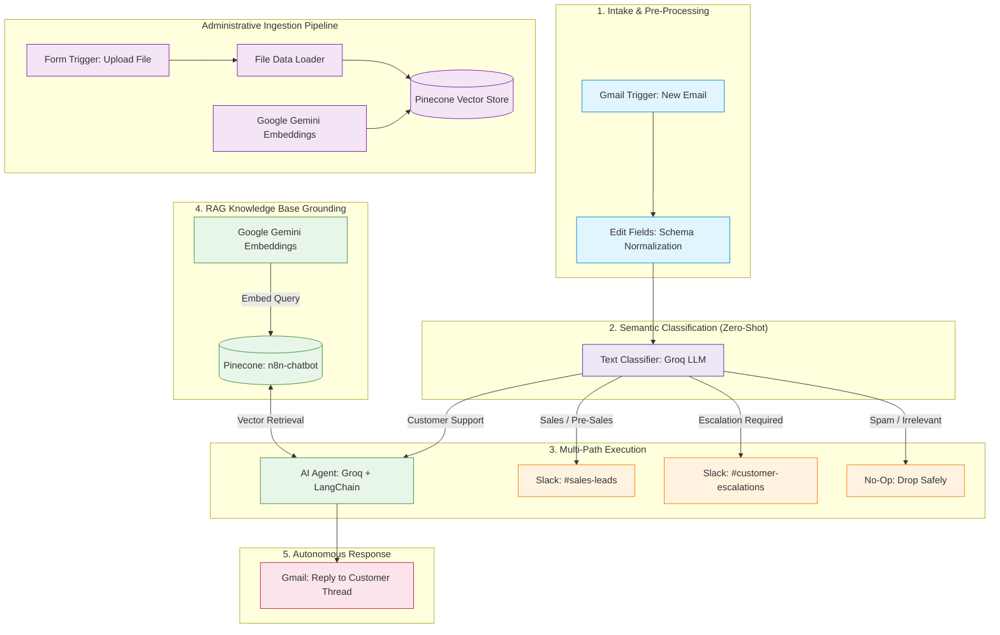
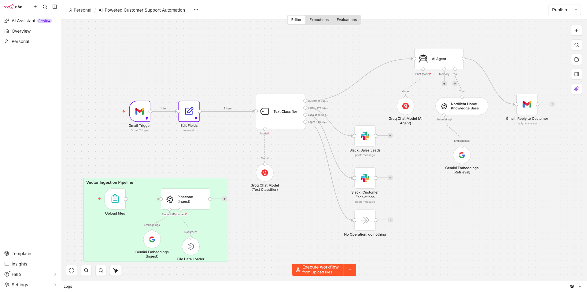
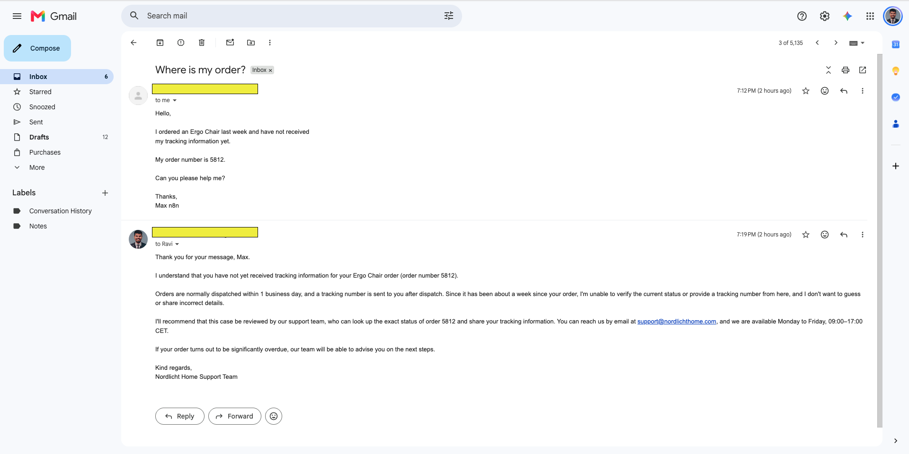
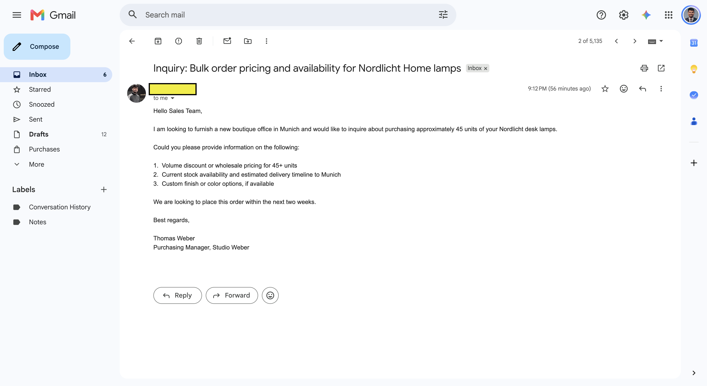
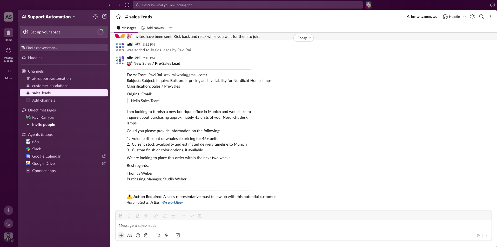
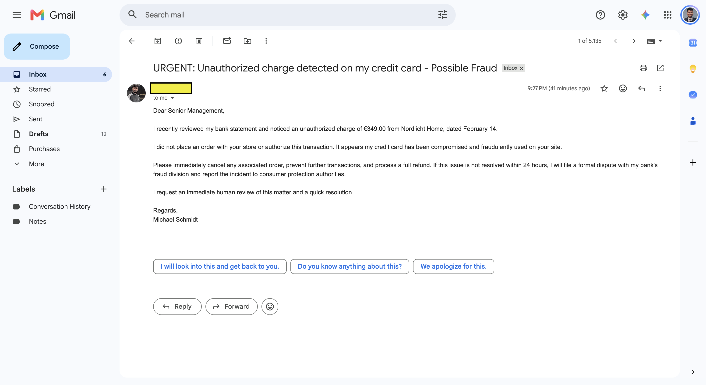
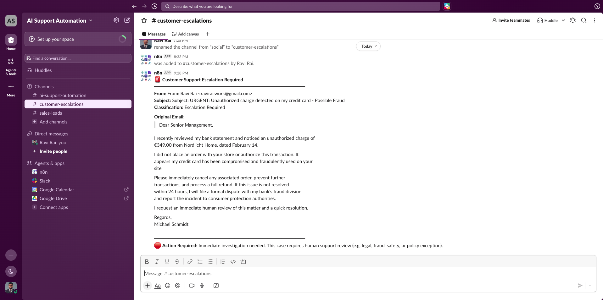

# AI-Powered Customer Support Automation & Triage Pipeline


An enterprise-grade, event-driven AI workflow that automates customer email intake, semantic intent triage, RAG-grounded support resolution, and multi-channel team escalation.

---

## 📌 Executive Summary

Customer support operations frequently suffer from three bottlenecks:
1. **High ticket volume** creating 24–48 hour response delays for routine policy inquiries.
2. **Sales lead leakage** when pre-sales queries sit unaddressed in generic support queues.
3. **Escalation delay** when urgent disputes (fraud, legal, safety) are not immediately brought to human attention.

This project delivers an autonomous, end-to-end automation pipeline built on **n8n** that monitors incoming customer emails, semantically classifies intent with high-speed LLM inference, resolves support questions autonomously via **Retrieval-Augmented Generation (RAG)** grounded against verified company policies, and routes pre-sales and critical disputes to dedicated internal Slack channels in real time.

---

## 🏗️ System Architecture



---

## 📸 Workflow Canvas

The canvas is architected with clear visual separation, background documentation notes, and discrete failure-tolerant paths:



---

## ⚙️ Key Technical Features & Engineering Highlights

### 1. Semantic Intent Classification Guardrails
- **Fast Zero-Shot Routing:** Uses a dedicated Groq chat model connected to an n8n LangChain Text Classifier to triage inbound text in sub-second latency.
- **Mutually Exclusive Domain Boundaries:** Categories are strictly partitioned (`Customer Support`, `Sales / Pre-Sales`, `Escalation Required`, `Spam / Irrelevant`) to prevent misclassification of high-value business leads or urgent fraud reports.
- **Exhaustive Routing (No Silent Drops):** Every branch has a defined destination, including an explicit `No-Op` for spam to ensure unhandled paths never trigger silent workflow exceptions.

### 2. Strict RAG Grounding (Pinecone + Gemini Embeddings)
- **Zero Hallucination Policy:** The autonomous agent prompt strictly forbids fabricating order statuses, pricing, or policy exceptions: *"Only answer based on retrieved context; do not invent information."*
- **Namespace Alignment:** Ingestion and retrieval pipelines use identical embedding models (`models/gemini-embedding-001`) and the same Pinecone namespace (`customer_support_knowledge_base`), ensuring vector space consistency.
- **Integrated Ingestion Pipeline:** Includes a self-contained form trigger sub-workflow allowing operators to drag-and-drop new policy documents (`.md`, `.pdf`) directly into Pinecone without touching infrastructure code.

### 3. Decoupled Internal Notifications (Slack)
- **Non-Blocking Execution:** Notifications sent to `#sales-leads` and `#customer-escalations` use Slack's `Message → Send` pattern rather than blocking human-in-the-loop wait nodes. This keeps the execution pipeline asynchronous and responsive.
- **Upstream Data Referencing:** Slack notifications reference the normalized upstream `$('Edit Fields')` node directly rather than ephemeral classifier states, guaranteeing resilient message formatting even during manual node debugging.

### 4. Direct Threaded Gmail Fulfillment
- Automatically attaches outbound replies directly to the customer's existing email thread (`messageId` mapping) with automated attribution stripped for a clean, professional customer experience.

---

## 🧪 Live Verification & Proof of Execution

The pipeline has been verified across all core classification paths using realistic test cases:

### Case 1: Autonomous Customer Support Resolution (RAG Flow)
*Customer asks for order tracking status for an Ergo Chair.*
- **Classification:** `Customer Support`
- **Result:** The AI Agent retrieves shipping policies from Pinecone and sends an accurate, grounded reply directly into the customer's Gmail thread.



---

### Case 2: Inbound Sales / Pre-Sales Lead Triage
*Customer inquires about bulk ordering 45 desk lamps for a boutique office.*
- **Classification:** `Sales / Pre-Sales`
- **Inbound Email:**



- **Slack Notification (`#sales-leads`):** Immediate alert with full context and customer contact details routed to the sales team:



---

### Case 3: Urgent Dispute Escalation (Possible Fraud)
*Customer reports an unauthorized charge of €349.00 and demands human intervention.*
- **Classification:** `Escalation Required`
- **Inbound Email:**



- **Slack Notification (`#customer-escalations`):** Real-time priority alert routed to senior management / compliance:



---

## 📁 Repository Structure

```text
01-ai-powered-customer-support-automation/
├── README.md                                    # Project documentation (this file)
├── ai-powered-customer-support-automation.json  # Sanitized n8n workflow export (ready to import)
├── docs/                                        # Deep-dive architecture & node specifications
│   └── workflow-explanation.md                 # Detailed node-by-node technical guide
├── assets/                                      # Canvas screenshots & verification evidence
│   ├── workflow-canvas.png
│   ├── test-support-ai-email-reply.png
│   ├── test-sales-inbound-email.png
│   ├── test-sales-slack-notification.png
│   ├── test-escalation-inbound-email.png
│   └── test-escalation-slack-notification.png
└── knowledge-base/                              # RAG source documents
    └── customer_support_knowledge_base.md       # Policy documentation for Nordlicht Home GmbH
```

> **Deep Dive:** For a comprehensive, node-by-node architectural breakdown and configuration details, read the [Workflow Explanation Guide](docs/workflow-explanation.md).

---

## 🚀 Quickstart & Reproduction Guide

### Prerequisites
- **n8n** (Self-hosted or n8n Cloud, v1.80+ recommended)
- **Groq API Key** (for high-speed Llama-3 inference)
- **Pinecone Account** (Serverless vector index created, dimension 768 or matching Gemini)
- **Google Cloud Console Credentials** (Gemini API for embeddings, Gmail OAuth2 for email trigger & reply)
- **Slack App / Bot Token** (with `chat:write` permissions to `#sales-leads` and `#customer-escalations`)

### 1. Import Workflow
1. In n8n, navigate to **Workflows** → **Add Workflow** → **Import from File**.
2. Select [`ai-powered-customer-support-automation.json`](ai-powered-customer-support-automation.json).

### 2. Connect Credentials
Assign your configured credentials to the respective nodes:
- `Gmail Trigger` & `Gmail: Reply to Customer` ➔ Gmail OAuth2 account
- `Groq Chat Model` nodes ➔ Groq API account
- `Gemini Embeddings` nodes ➔ Google Gemini / PaLM API account
- `Pinecone` nodes ➔ Pinecone API account
- `Slack` nodes ➔ Slack API account

### 3. Ingest the Knowledge Base
1. Open the **Upload files** form trigger node in the Vector Ingestion Pipeline.
2. Click **Test step** or open the form URL.
3. Upload [`knowledge-base/customer_support_knowledge_base.md`](knowledge-base/customer_support_knowledge_base.md).
4. Run the node to populate your Pinecone index under namespace `customer_support_knowledge_base`.

### 4. Activate & Test
1. Set the workflow to **Active**.
2. Send test emails to your connected Gmail account to verify automatic classification, Slack alerts, and RAG replies.
