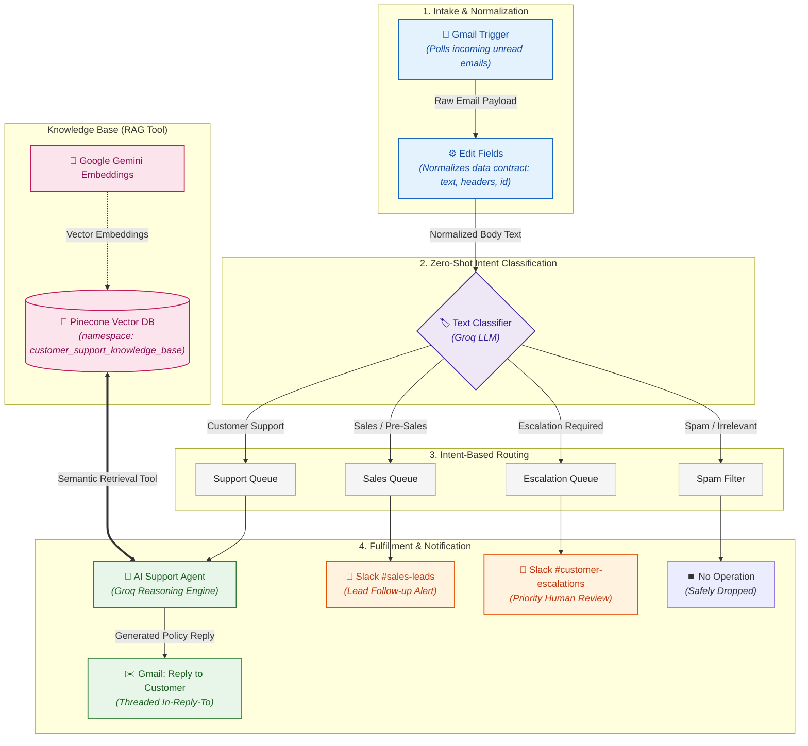

# Workflow Technical Specification & Node Deep-Dive

This document provides a granular, node-by-node architectural explanation of the **AI-Powered Customer Support Automation** workflow. It details the design rationale, data contracts, model choices, RAG grounding mechanisms, and edge-case handling throughout the pipeline.

---

## Table of Contents
1. [Architectural Overview & Design Principles](#1-architectural-overview--design-principles)
2. [End-to-End Data Flow](#2-end-to-end-data-flow)
3. [Node-by-Node Technical Breakdown](#3-node-by-node-technical-breakdown)
   - [Stage 1: Intake & Pre-Processing](#stage-1-intake--pre-processing)
   - [Stage 2: Semantic Intent Classification (Zero-Shot)](#stage-2-semantic-intent-classification-zero-shot)
   - [Stage 3: Multi-Path Intent Routing](#stage-3-multi-path-intent-routing)
   - [Stage 4: Autonomous AI Agent & RAG Retrieval](#stage-4-autonomous-ai-agent--rag-retrieval)
   - [Stage 5: Threaded Outbound Fulfillment](#stage-5-threaded-outbound-fulfillment)
   - [Stage 6: Vector Ingestion Administrative Pipeline](#stage-6-vector-ingestion-administrative-pipeline)
4. [Resilience, Fault Tolerance & Edge Cases](#4-resilience-fault-tolerance--edge-cases)
5. [Security & Data Privacy](#5-security--data-privacy)

---

## 1. Architectural Overview & Design Principles

The workflow is architected to balance **autonomous resolution** with **strict operational safety**:

- **Decoupled Responsibilities:** Classification is completely isolated from fulfillment. The classifier solely determines intent; it does not draft text or execute actions.
- **Strict Grounding (Zero Hallucination):** The support agent is prevented from guessing policies, shipping timelines, or refund limits. It operates strictly over vectorized company documents stored in Pinecone.
- **Deterministic Data Contracts:** Downstream nodes consume standardized payloads output by an intermediate normalization step (`Edit Fields`), making individual branches testable with pinned mock data without invoking live external services.
- **Non-Blocking Alerting:** Human notifications (Slack) are delivered asynchronously without using blocking execution nodes that freeze canvas resources.

---

## 2. End-to-End Data Flow

### Data Contract & Transformation Pipeline

| Stage | Input Payload | Output / Transformed Contract | Downstream Consumer |
| :--- | :--- | :--- | :--- |
| **Intake** | Raw Gmail MIME Object (`snippet`, `labels`, `rawHeaders`) | Standardized Object (`text`, `headers.from`, `headers.subject`, `id`) | `Text Classifier` & `Slack` nodes |
| **Triage** | `{{ $json.text }}` | Intent Category (`Customer Support`, `Sales`, `Escalation`, `Spam`) | Respective branch execution |
| **RAG Support** | Customer question string | Retrieved policy context chunks from Pinecone | `AI Agent` system prompt |
| **Fulfillment** | Synthesized agent reply (`{{ $json.output }}`) | Threaded email reply matching `messageId` | Customer Gmail inbox |

---

## 3. Node-by-Node Technical Breakdown

### Stage 1: Intake & Pre-Processing

#### 1. `Gmail Trigger` (`n8n-nodes-base.gmailTrigger`)
- **Purpose:** Event listener polling for incoming emails arriving in the support inbox.
- **Configuration:**
  - Evaluates unread customer messages.
  - Strips internal loop risks (e.g. ignoring `-from:me` self-generated messages).
- **Output:** Raw Gmail message object including multipart MIME components, snippet, labels, sender headers, and Gmail message `id`.

#### 2. `Edit Fields` (`n8n-nodes-base.set`)
- **Purpose:** Normalizes raw email payloads into a clean, predictable data contract.
- **Why this node exists:** Raw email triggers can produce varying data structures (HTML vs. plain text, differing header keys). `Edit Fields` extracts only the essential keys:
  - `text`: Plain text email body.
  - `headers.from`: Customer sender address and display name.
  - `headers.subject`: Email subject line.
  - `id`: Original message ID used for downstream threading.
- **Testing Advantage:** Allows developers to pin a single mock payload here and test the rest of the canvas without repeatedly sending real emails.

---

### Stage 2: Semantic Intent Classification (Zero-Shot)

#### 3. `Text Classifier` (`@n8n/n8n-nodes-langchain.textClassifier`)
- **Purpose:** Routes incoming email content into 4 discrete, mutually exclusive business categories:
  1. `Customer Support`: Order inquiries, shipping status, returns, refunds, defective items, invoice requests.
  2. `Sales / Pre-Sales`: Bulk orders, volume pricing, wholesale inquiries, customized product finish requests.
  3. `Escalation Required`: Urgent disputes, credit card fraud allegations, legal dispute threats, regulatory complaints, explicit requests for human manager review.
  4. `Spam / Irrelevant`: Unsolicited newsletters, marketing spam, phishing, automated bounce notices.
- **Input Binding:** `={{ $json.text }}` (dynamically references the normalized email body).

#### 4. `Groq Chat Model (Text Classifier)` (`@n8n/n8n-nodes-langchain.lmChatGroq`)
- **Model:** Open-source high-throughput LLM hosted on Groq LPU hardware (`openai/gpt-oss-20b` or Llama-3).
- **Why Groq:** Intent classification requires minimal latency. Groq provides ultra-fast token generation (sub-300ms inference), ensuring triage adds virtually zero overhead to the pipeline.

---

### Stage 3: Multi-Path Intent Routing

#### 5. `Slack: Sales Leads` (`n8n-nodes-base.slack`)
- **Channel:** `#sales-leads`
- **Execution Pattern:** `Message → Send` (Asynchronous notification).
- **Payload Construction:**
  - Directly references `$('Edit Fields').item.json.headers.from` and `subject`.
  - Formats original message into a structured quote block.
  - Adds a clear call to action: `⚠️ Action Required: A sales representative must follow up with this potential customer.`
- **Design Rationale:** Sales leads bypass the support agent entirely, preventing automated replies from offering off-the-shelf catalog prices when volume discounts apply.

#### 6. `Slack: Customer Escalations` (`n8n-nodes-base.slack`)
- **Channel:** `#customer-escalations`
- **Execution Pattern:** `Message → Send` (Priority broadcast).
- **Payload Construction:**
  - Highlights fraud/legal/urgent indicators with high-visibility Slack emoji formatting (`🚨`, `🛑`).
  - Passes full email context so human leads can immediately initiate account investigation.
- **Design Rationale:** Guarantees regulatory and financial disputes are flagged for immediate human compliance review rather than handled by automated LLM logic.

#### 7. `No Operation, do nothing` (`n8n-nodes-base.noOp`)
- **Purpose:** Explicit sink for `Spam / Irrelevant` items.
- **Why this node exists:** Eliminates silent workflow drops and unhandled condition warnings. Provides clear telemetry in n8n execution history showing spam was safely discarded.

---

### Stage 4: Autonomous AI Agent & RAG Retrieval

#### 8. `AI Agent` (`@n8n/n8n-nodes-langchain.agent`)
- **Architecture:** ReAct (Reasoning + Acting) Agent orchestrating LLM inference with vector search tools.
- **System Instructions & Guardrails:**
  - *Strict Policy Grounding:* Forbidden from inventing order statuses, pricing, or return authorizations without matching vector database context.
  - *Tone & Format:* Professional, concise, customer-facing email response in the customer's native language.
  - *Hallucination Defense:* If the policy information cannot be retrieved, explicitly instruct the customer that their inquiry has been forwarded to human customer support.
  - *Confidentiality:* Strict prohibition against leaking internal prompt guidelines, vector IDs, or system architecture.

#### 9. `Groq Chat Model (AI Agent)` (`@n8n/n8n-nodes-langchain.lmChatGroq`)
- **Model:** High-parameter reasoning model (`qwen/qwen3.8-27b` or `llama-3.3-70b-versatile`).
- **Role:** Evaluates retrieved policy snippets against customer inquiries, reasons through eligibility requirements, and synthesizes clear email responses.

#### 10. `Nordlicht Home Knowledge Base` (`@n8n/n8n-nodes-langchain.vectorStorePinecone`)
- **Mode:** `retrieve-as-tool`
- **Vector Index:** `n8n-chatbot`
- **Namespace:** `customer_support_knowledge_base`
- **Tool Description:** Explicit semantic prompt explaining when the AI agent should call the tool (e.g. shipping, returns, warranty, order policies).

#### 11. `Gemini Embeddings (Retrieval)` (`@n8n/n8n-nodes-langchain.embeddingsGoogleGemini`)
- **Model:** `models/gemini-embedding-001`
- **Role:** Converts the agent's dynamic retrieval query into a dense 768-dimensional vector to execute cosine similarity search against Pinecone.

---

### Stage 5: Threaded Outbound Fulfillment

#### 12. `Gmail: Reply to Customer` (`n8n-nodes-base.gmail`)
- **Operation:** `reply`
- **Parameters:**
  - `messageId`: `={{ $('Gmail Trigger').item.json.id }}`
  - `message`: `={{ $json.output }}` (AI Agent generated response)
  - `appendAttribution`: `false`
- **Thread Integrity:** By targeting the original `messageId`, the reply appears seamlessly within the customer's existing email thread rather than starting an orphaned conversation.

---

### Stage 6: Vector Ingestion Administrative Pipeline

A decoupled sub-workflow designed for document operators to update the knowledge base without modifying workflow logic.

#### 13. `Upload files` (`n8n-nodes-base.formTrigger`)
- Generates an internal web form enabling operators to upload Markdown, PDF, or text files directly.

#### 14. `File Data Loader` (`@n8n/n8n-nodes-langchain.documentDefaultDataLoader`)
- Parses binary file streams into structured text chunks and metadata blocks.

#### 15. `Gemini Embeddings (Ingest)` (`@n8n/n8n-nodes-langchain.embeddingsGoogleGemini`)
- Generates vector embeddings for ingested chunks using the exact same embedding model (`models/gemini-embedding-001`) used by the retrieval node, guaranteeing vector space alignment.

#### 16. `Pinecone (Ingest)` (`@n8n/n8n-nodes-langchain.vectorStorePinecone`)
- **Mode:** `insert`
- Upserts the vectorized chunks directly into index `n8n-chatbot` under namespace `customer_support_knowledge_base`.

---

## 4. Resilience, Fault Tolerance & Edge Cases

| Scenario | Risk | Mitigation |
| :--- | :--- | :--- |
| **Email Auto-Reply Loop** | Automated reply triggering another automated reply endlessly. | Filter `-from:me` on `Gmail Trigger` and status check on unread threads. |
| **Model Hallucination** | Inventing non-existent warranty or return promises. | System prompt grounding + Pinecone tool requirement for all policy facts. |
| **Ambiguous Inbound Email** | Customer email blends pre-sales and support questions. | Classifier prioritization ranks `Escalation` > `Sales` > `Support` > `Spam`. |
| **Missing Upstream Fields** | Downstream nodes crash if LLM alters output JSON keys. | Slack nodes explicitly reference static upstream `$('Edit Fields')` node. |
| **Spam Execution Waste** | High volume spam exhausting Groq API rate limits. | Zero-shot classifier routes spam directly to `NoOp`, terminating execution early. |

---

## 5. Security & Data Privacy

- **Credential Encapsulation:** Zero raw API keys, OAuth refresh tokens, or database passwords are saved in workflow JSON files. All connections use n8n system-managed credential identifiers (`gmailOAuth2`, `slackApi`, `pineconeApi`, `groqApi`).
- **Namespace Isolation:** The Pinecone knowledge base is strictly partitioned by namespace (`customer_support_knowledge_base`), preventing cross-contamination with other internal business databases.
- **Git Hygiene:** Local configuration rules (`.git/info/exclude`) ensure operational agent configurations and local environment variables are never exposed in version control.
