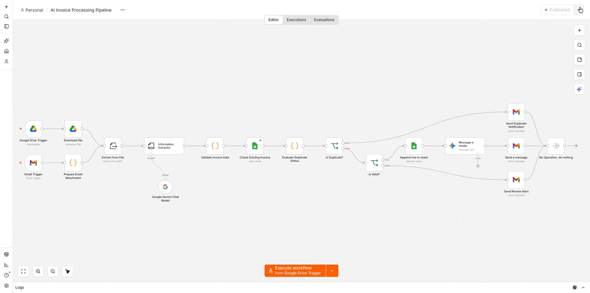
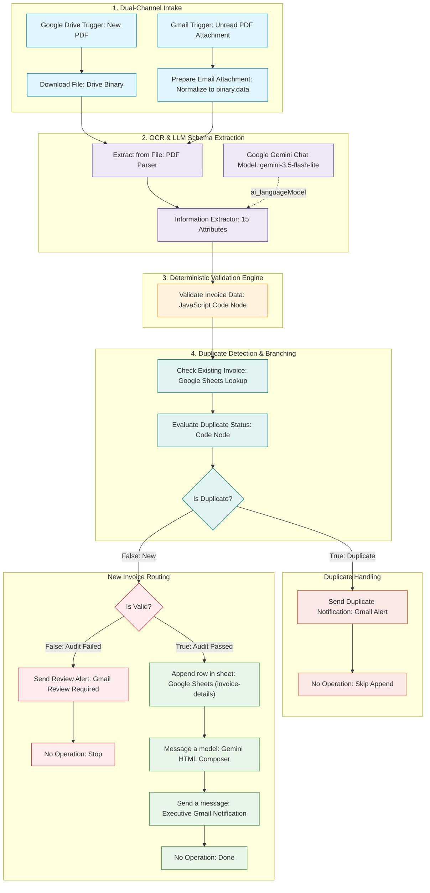
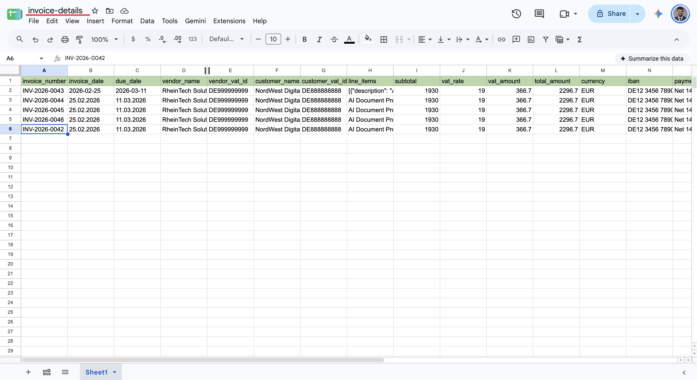
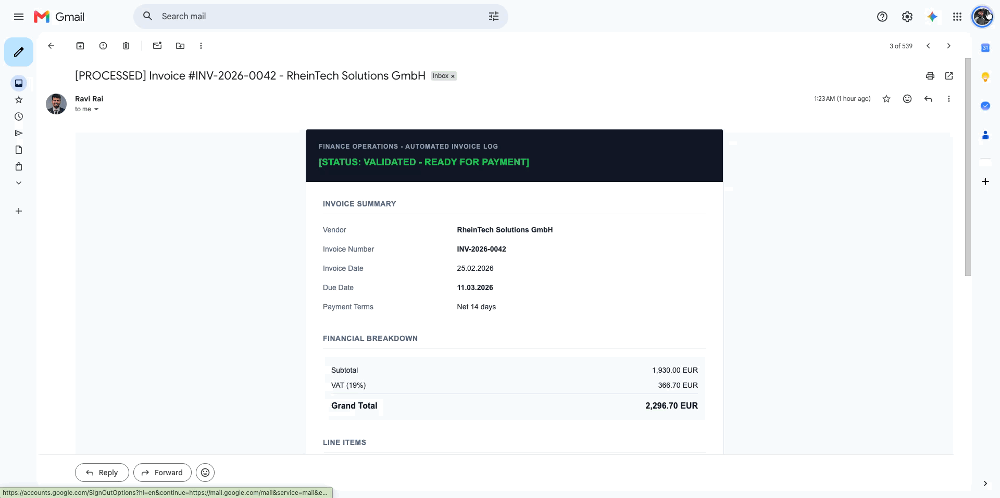
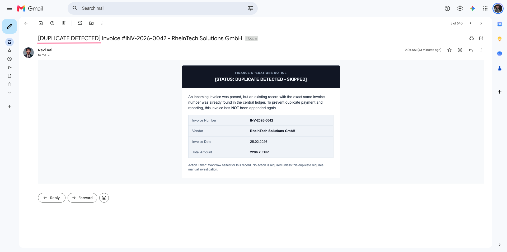
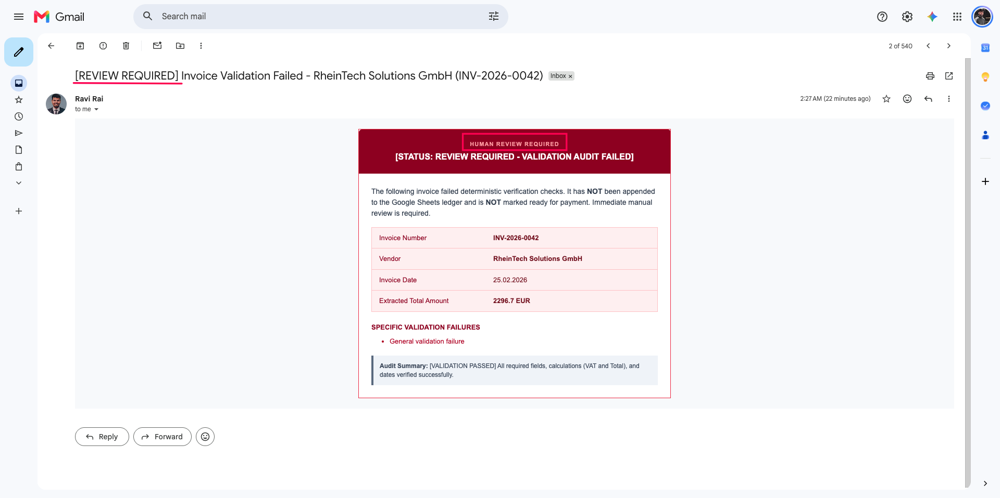

# AI Invoice Processing & Verification Pipeline


An enterprise-grade, event-driven automation pipeline built on **n8n** that ingests PDF invoices via **Google Drive** or **Gmail**, extracts 15 structured fields via **Google Gemini**, verifies mathematical and date consistency deterministically with JavaScript, checks for duplicates against **Google Sheets**, routes failed audits to **Human Review**, appends verified records to the central ledger, and dispatches executive HTML notifications via **Gmail**.

---

## 📌 Executive Summary

Manual invoice processing in accounts payable departments is traditionally plagued by:
1. **Multi-channel intake chaos:** Invoices arrive inconsistently via cloud drives and scattered email inboxes, leading to lost attachments and delayed processing.
2. **Duplicate payment risks:** Vendors occasionally resend invoices or submit duplicates across email and drive channels, risking double payment without automated ledger checks.
3. **Invisible arithmetic errors:** Inconsistencies between line item sums, VAT rates, and declared gross totals slip into financial records unnoticed.
4. **Unreviewed liabilities:** Invoices with missing fields or arithmetic errors get approved blindly due to volume pressure.

This workflow delivers a unified, autonomous solution that converges Google Drive and Gmail PDF streams, extracts structured invoice attributes with Gemini, deterministically audits calculations and dates, intercepts duplicates before writing, isolates audit failures for human review, and notifies stakeholders with professional HTML digests.

---

## Live System Demonstration

### Automated End-to-End Canvas Execution
Real-time n8n canvas run demonstrating dual-channel trigger convergence, Gemini structured extraction, deterministic validation, and multi-path routing:



---

## 🏗️ System Architecture



---

## ⚙️ Key Technical Features & Engineering Highlights

### 1. Unified Dual-Channel Intake (Google Drive & Gmail)
- **Google Drive Trigger:** Monitors `invoice-parser` folder for newly uploaded invoice PDFs.
- **Gmail Trigger:** Watches for unread incoming emails matching `has:attachment filename:pdf -from:me`.
- **Stream Normalization (`Prepare Email Attachment`):** Extracts raw email binary streams and normalizes them to `binary.data` so both drive and email streams converge seamlessly into the single `Extract from File` node without duplicating the rest of the pipeline.

### 2. 15-Field Strict Schema Extraction (Gemini)
The **Information Extractor** node runs on `models/gemini-3.5-flash-lite` with strict grounding prompts:
- Fields extracted: `invoice_number`, `invoice_date`, `due_date`, `vendor_name`, `vendor_vat_id`, `customer_name`, `customer_vat_id`, `line_items`, `subtotal`, `vat_rate`, `vat_amount`, `total_amount`, `currency`, `iban`, `payment_terms`.
- Strict hallucination prevention: Values must be explicitly stated in the text; missing fields are set to `null`.

### 3. Deterministic Mathematical & Date Validation
Generative AI outputs are audited by a dedicated JavaScript Code node before writing to storage:
- **Date Normalization:** Resolves variable input formats (`YYYY-MM-DD`, `DD/MM/YYYY`, timestamps) into standard European **`DD.MM.YYYY`**.
- **Date Chronology:** Asserts that `due_date >= invoice_date`.
- **VAT Calculation:** Validates `| (subtotal * vat_rate / 100) - vat_amount | <= 0.05` to prevent tax reporting errors.
- **Total Calculation:** Validates `| (subtotal + vat_amount) - total_amount | <= 0.05`.
- **Audit Emittance:** Assigns `is_valid` (`boolean`), `validation_status` (`PASSED`, `PASSED_WITH_WARNINGS`, `FAILED_CHECKS`), and full error/warning lists.

### 4. Idempotent Duplicate Detection
- **Google Sheets Lookup:** Before writing to the sheet, the workflow queries `invoice-details` filtering by `invoice_number`.
- **Duplicate Interception:** If a record with the same invoice number exists:
  - Marked as `DUPLICATE`.
  - Halted from appending to Google Sheets.
  - Generates an immediate `[DUPLICATE DETECTED]` Gmail notification to finance.

### 5. Dedicated Human Review Path for Audit Failures
- **Deterministic Routing:** When `is_valid === false`, execution branches away from Google Sheets.
- **Actionable Alert:** Sends a `[REVIEW REQUIRED]` Gmail notification specifying the invoice reference, vendor name, extracted amount, and a bulleted list of exact arithmetic or required-field failures.
- **Disbursement Protection:** Unverified invoices are never marked ready for payment.

### 6. Professional Corporate Email Notification (Zero Emojis)
- **Tone & Typography:** Complies with strict corporate standards—no emojis (no checkmarks or warning symbols).
- **Dynamic Subject:**
  - Valid: `[PROCESSED] Invoice #INV-2026-0042 - RheinTech Solutions GmbH`
  - Review: `[REVIEW REQUIRED] Invoice Validation Failed - RheinTech Solutions GmbH (INV-2026-0042)`
  - Duplicate: `[DUPLICATE DETECTED] Invoice #INV-2026-0042 - RheinTech Solutions GmbH`
- **Responsive HTML:** Modern card layout with metadata summary, validation audit table, line items breakdown, financial totals, and IBAN/BIC wire details.

---

## 📸 Production Verification & Visual Proofs

### 1. Central Ledger Ingestion (Google Sheets)
Verified invoices appended automatically to `invoice-details` (`Sheet1`) with normalized European dates (`DD.MM.YYYY`), calculated financial totals, and cleaned, single-line compacted line item strings:



---

### 2. Verified Invoice Notification (Happy Path)
Generated executive HTML email in Gmail showcasing audit verification badges, transaction metadata, itemized line items table, financial breakdown, and payment routing info:



---

### 3. Duplicate Invoice Interception (Idempotency Proof)
When an invoice with a previously processed `invoice_number` arrives, the pipeline intercepts it before writing to Google Sheets and dispatches an instant duplicate alert:



---

### 4. Human Review Required (Audit Failure Safeguard)
When an invoice has arithmetic inconsistencies, missing required fields, or chronological date errors, it is blocked from payment approval and logged with specific failure details:



---

## 🚀 Setup & Deployment Guide

### Prerequisites
- Self-hosted or cloud **n8n** instance (v1.80+ or v2.x).
- Google Cloud Project with OAuth credentials enabled for:
  - **Google Drive API** (access to watch folder)
  - **Google Sheets API** (access to read/append rows)
  - **Gmail API** (access to trigger on incoming emails and send notifications)
- Google Gemini API Key (`googlePalmApi`).

### Step 1: Import the Workflow
1. In your n8n workspace, navigate to **Workflows → Import from File**.
2. Select [`ai-invoice-processing-pipeline.json`](ai-invoice-processing-pipeline.json).

### Step 2: Configure Credentials
1. **Google Drive account:** Select your `googleDriveOAuth2Api` credential on `Google Drive Trigger` and `Download file`.
2. **Google Gemini account:** Select your `googlePalmApi` credential on `Google Gemini Chat Model` and `Message a model`.
3. **Google Sheets account:** Select your `googleSheetsOAuth2Api` credential on `Check Existing Invoice` and `Append row in sheet`.
4. **Gmail account:** Select your `gmailOAuth2` credential on `Gmail Trigger`, `Send Duplicate Notification`, `Send Review Alert`, and `Send a message`.

### Step 3: Configure Folder & Sheet IDs
1. **Google Drive Trigger:** Pick or enter your dedicated incoming invoices folder (e.g. `invoice-parser`).
2. **Google Sheets Nodes:** Select your central tracking Google Sheet (e.g. `invoice-details`) and worksheet `Sheet1` on both `Check Existing Invoice` and `Append row in sheet`.
3. Ensure the spreadsheet contains the 15 header columns:
   `invoice_number`, `invoice_date`, `due_date`, `vendor_name`, `vendor_vat_id`, `customer_name`, `customer_vat_id`, `line_items`, `subtotal`, `vat_rate`, `vat_amount`, `total_amount`, `currency`, `iban`, `payment_terms`.

### Step 4: Test & Activate
1. Drop a sample PDF invoice (see [`sample-invoice-data.md`](sample-invoices/sample-invoice-data.md)) into your Google Drive folder or email it as an attachment to your connected Gmail inbox.
2. Click **Test step** or **Execute workflow** on the canvas to verify execution.
3. Toggle the workflow to **Active**.

---

## 📁 Repository Structure

```
02-ai-invoice-processing-pipeline/
├── README.md                                      # Executive summary, architecture, and visual proofs
├── ai-invoice-processing-pipeline.json            # Production-ready, sanitized n8n workflow definition
├── docs/
│   └── workflow-explanation.md                    # Granular technical breakdown and data contracts
├── sample-invoices/
│   └── sample-invoice-data.md                     # Synthetic test invoice payload and text content
└── assets/
    ├── workflow-canvas-execution.gif              # Live canvas execution recording
    ├── google-sheets-invoice-ledger.png           # Production Google Sheets ledger capture
    ├── invoice-processed-email-demo.gif           # Executive HTML email notification demo
    ├── duplicate-detected-email-alert.png         # Duplicate invoice interception alert capture
    └── review-required-audit-failure-alert.png    # Audit failure review-required alert capture
```

---

## 📄 License

This workflow is licensed under the [MIT License](../LICENSE).
