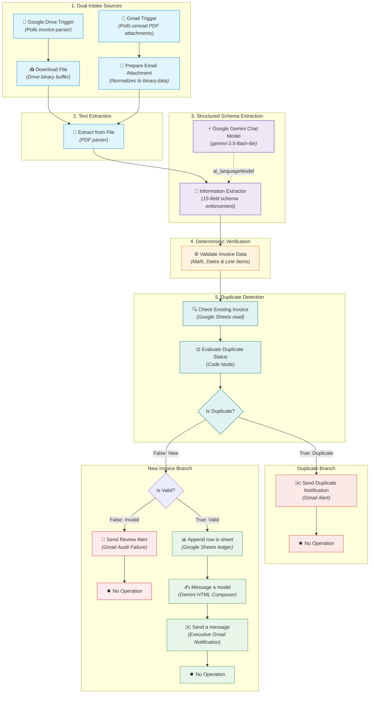

# Workflow Technical Specification & Node Deep-Dive

This document provides a granular, node-by-node technical specification for the **AI Invoice Processing Pipeline** n8n workflow. It details the dual-intake architecture (Google Drive & Gmail), structured Gemini extraction contracts, deterministic mathematical validation, Google Sheets duplicate detection, human review routing, and corporate email notification architecture.

---

## Table of Contents
1. [Architectural Overview & Design Principles](#1-architectural-overview--design-principles)
2. [End-to-End Data Flow](#2-end-to-end-data-flow)
3. [Node-by-Node Technical Breakdown](#3-node-by-node-technical-breakdown)
   - [Stage 1: Dual Intake & OCR Ingestion (Google Drive & Gmail)](#stage-1-dual-intake--ocr-ingestion-google-drive--gmail)
   - [Stage 2: LLM Information Extraction (Gemini)](#stage-2-llm-information-extraction-gemini)
   - [Stage 3: Deterministic Verification & Normalization](#stage-3-deterministic-verification--normalization)
   - [Stage 4: Google Sheets Duplicate Detection & Branching](#stage-4-google-sheets-duplicate-detection--branching)
   - [Stage 5: Human Review Branch (Audit Failures)](#stage-5-human-review-branch-audit-failures)
   - [Stage 6: Central Ledger Logging & Executive Notification (Happy Path)](#stage-6-central-ledger-logging--executive-notification-happy-path)
4. [Validation Logic & Mathematical Integrity](#4-validation-logic--mathematical-integrity)
5. [Security, Credentials & Data Privacy](#5-security-credentials--data-privacy)

---

## 1. Architectural Overview & Design Principles

The pipeline is engineered following enterprise automation standards:

- **Dual-Intake Convergence:** Accommodates both file drops (Google Drive folder polling) and incoming emails (Gmail trigger with PDF attachment filtering). Attachments are normalized into a uniform binary buffer (`binary.data`) before feeding into a single, shared processing pipeline.
- **Strict Separation of Extraction and Verification:** Generative AI extracts structured JSON from unstructured text, but is *never* trusted for business or arithmetic validity. A deterministic JavaScript code node executes verifiable mathematical and date consistency checks.
- **Idempotency & Duplicate Prevention:** Before logging any invoice to Google Sheets or marking it ready for payment, the workflow queries the sheet for an existing `invoice_number`. Duplicates are flagged, logged, and alerted via email without writing duplicate ledger entries.
- **Explicit Human Review Routing:** Invoices that fail required fields, date order, VAT calculation, or total balance are immediately routed to a dedicated `REVIEW_REQUIRED` email path detailing the exact failures, preventing unverified liabilities from reaching payment.
- **Tone & Format Standards:** Enforces strict corporate communication—all automated emails and subjects are free of emojis, using clean typographic status badges and responsive HTML layouts.

---

## 2. End-to-End Data Flow



---

## 3. Node-by-Node Technical Breakdown

### Stage 1: Dual Intake & OCR Ingestion (Google Drive & Gmail)

#### 1. Google Drive Trigger (`n8n-nodes-base.googleDriveTrigger`)
- **Event:** `fileCreated` in folder `invoice-parser` (`1TSc1634qIL7qljaId-DSpXqraqCv1U6j`).
- **Poll Interval:** `everyMinute`.

#### 2. Download File (`n8n-nodes-base.googleDrive`)
- **Operation:** `download` for `={{ $json.id }}`.
- **Output:** Binary buffer under property `data`.

#### 3. Gmail Trigger (`n8n-nodes-base.gmailTrigger`)
- **Filters:** `q: "has:attachment filename:pdf -from:me"`, `readStatus: "unread"`.
- **Options:** `downloadAttachments: true`, `dataPropertyAttachmentsPrefixName: "attachment_"`.
- **Simple Mode:** `false` (enables full MIME download).

#### 4. Prepare Email Attachment (`n8n-nodes-base.code`)
- **Function:** Detects the downloaded attachment from Gmail and maps it to standard `binary.data` with metadata tags (`intake_source: 'gmail'`).
- **Convergence:** Connects directly into `Extract from File`, unifying processing with the Google Drive branch.

#### 5. Extract from File (`n8n-nodes-base.extractFromFile`)
- **Operation:** `pdf`.
- **Output:** `$json.text`.

---

### Stage 2: LLM Information Extraction (Gemini)

#### 6. Information Extractor (`@n8n/n8n-nodes-langchain.informationExtractor`)
- **Model:** `models/gemini-3.5-flash-lite` (`Google Gemini Chat Model`).
- **Schema Mode:** `fromAttributes` (15 fields).
- **System Instructions:** Strict grounding enforcing null for missing fields and ISO/European date formatting.

---

### Stage 3: Deterministic Verification & Normalization

#### 7. Validate Invoice Data (`n8n-nodes-base.code`)
- **Date Normalization:** All date inputs normalized to `DD.MM.YYYY`.
- **Required Fields:** `invoice_number`, `invoice_date`, `vendor_name`, `total_amount`, `currency`.
- **Date Consistency:** `due_date >= invoice_date`.
- **VAT Math:** `| (subtotal * vat_rate / 100) - vat_amount | <= 0.05`.
- **Total Math:** `| (subtotal + vat_amount) - total_amount | <= 0.05`.
- **Line Items:** Compacted into readable semicolon-separated string for Google Sheets; raw array saved to `line_items_raw`.

---

### Stage 4: Google Sheets Duplicate Detection & Branching

#### 8. Check Existing Invoice (`n8n-nodes-base.googleSheets`)
- **Operation:** `read` on sheet `invoice-details`.
- **Filter:** `lookupColumn: "invoice_number"`, `lookupValue: "={{ $('Validate Invoice Data').item.json.invoice_number }}"`.
- **Settings:** `alwaysOutputData: true` (ensures non-matching runs do not halt execution).

#### 9. Evaluate Duplicate Status (`n8n-nodes-base.code`)
- Merges the original validated invoice fields with `is_duplicate: boolean` and `duplicate_matched_row`.

#### 10. Is Duplicate? (`n8n-nodes-base.if`)
- **Condition:** `{{ $json.is_duplicate }} === true`.
- **Branch 0 (True):** Routes to `Send Duplicate Notification`.
- **Branch 1 (False):** Routes to `Is Valid?`.

#### 11. Send Duplicate Notification (`n8n-nodes-base.gmail`)
- **Subject:** `=[DUPLICATE DETECTED] Invoice #{{ $json.invoice_number }} - {{ $json.vendor_name }}`.
- **Body:** Responsive HTML informing finance that the invoice was already logged and has been skipped to prevent duplicate disbursement.

---

### Stage 5: Human Review Branch (Audit Failures)

#### 12. Is Valid? (`n8n-nodes-base.if`)
- **Condition:** `{{ $json.is_valid }} === true`.
- **Branch 0 (True):** Routes to `Append row in sheet`.
- **Branch 1 (False):** Routes to `Send Review Alert`.

#### 13. Send Review Alert (`n8n-nodes-base.gmail`)
- **Subject:** `=[REVIEW REQUIRED] Invoice Validation Failed - {{ $json.vendor_name || 'Unknown Vendor' }} ({{ $json.invoice_number || 'N/A' }})`.
- **Body:** Formatted HTML highlighting extracted values alongside a bulleted list of all specific validation errors and audit warnings.

---

### Stage 6: Central Ledger Logging & Executive Notification (Happy Path)

#### 14. Append Row in Sheet (`n8n-nodes-base.googleSheets`)
- **Operation:** `append` into `invoice-details` / `Sheet1`.
- **Columns:** All 15 validated fields mapped via `defineBelow`.

#### 15. Message a Model (`@n8n/n8n-nodes-langchain.googleGemini`)
- **Model:** `models/gemini-1.5-flash`.
- **Prompting:** Generates professional HTML email digest without emojis, featuring audit checks, metadata grid, and line items table.

#### 16. Send a Message (`n8n-nodes-base.gmail`)
- **Subject:** `=[PROCESSED] Invoice #{{ $('Validate Invoice Data').item.json.invoice_number }} - {{ $('Validate Invoice Data').item.json.vendor_name }}`.
- **Body:** Safely extracted HTML from model response:
  ```javascript
  ={{ (typeof $json.text === 'string' && $json.text) ? $json.text : ($json.content?.parts?.[0]?.text || (typeof $json.content === 'string' ? $json.content : '') || $('Message a model').item.json.content?.parts?.[0]?.text || $('Message a model').item.json.text || '') }}
  ```

#### 17. No Operation (`n8n-nodes-base.noOp`)
- Clean execution sink for all terminal branches.
