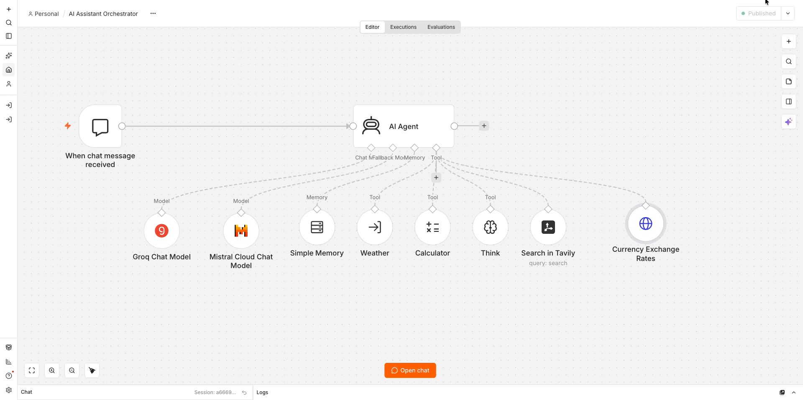
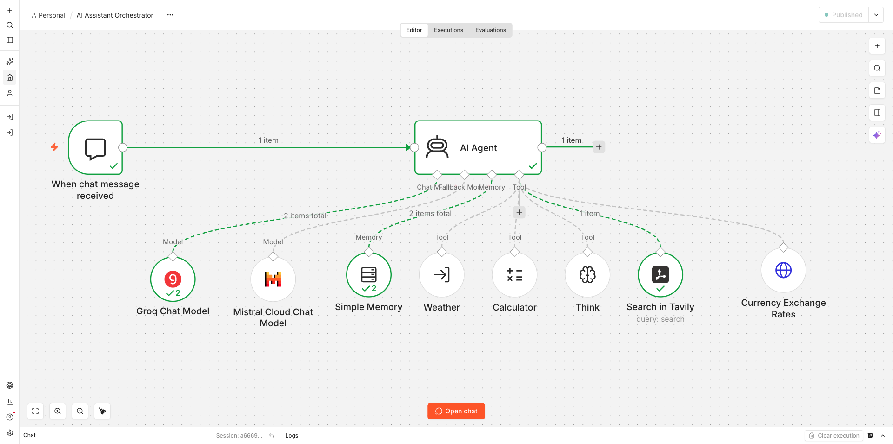
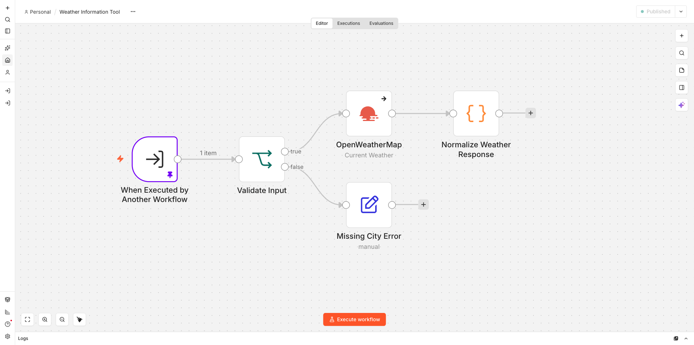
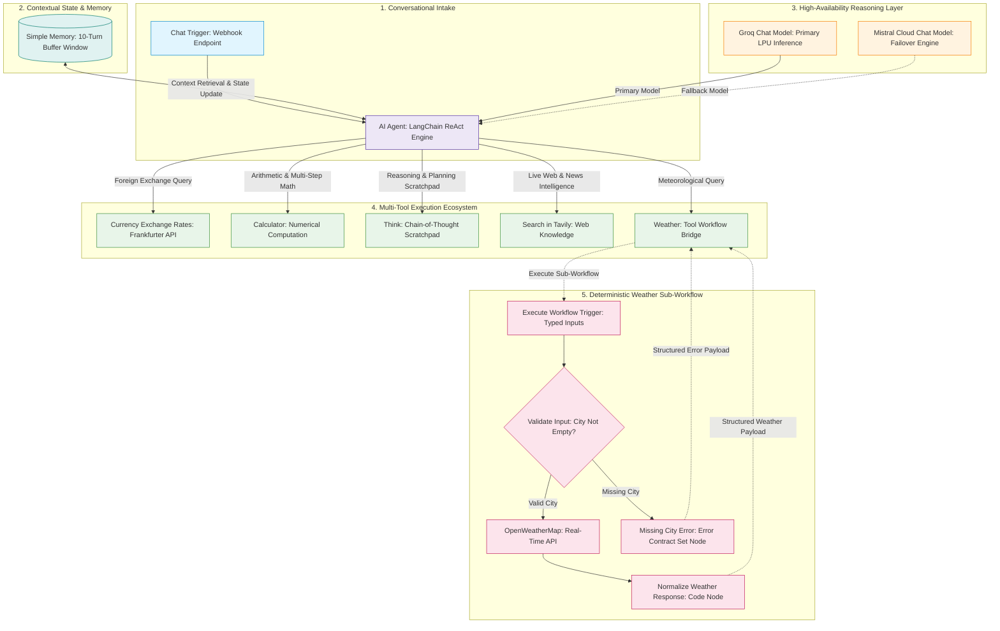

# AI Assistant Orchestrator & Specialized Tool Ecosystem


-F55036?style=for-the-badge&logo=groq&logoColor=white)


An enterprise-grade, multi-tool **AI Assistant Orchestrator** built on **n8n** and **LangChain**. It features dynamic tool selection, dual-model failover (Groq primary + Mistral fallback), multi-turn conversational memory, real-time foreign exchange rate retrieval, deterministic sub-workflow weather intelligence, arithmetic precision calculation, and targeted web intelligence with anti-overlap guardrails.

---

## Executive Summary

Modern AI assistants frequently fail in production due to three architectural flaws:
1. **Hallucination of Volatile Metrics:** LLMs attempt to estimate currency exchange rates, financial figures, or local weather conditions from static training weights.
2. **Tool Boundary Collisions:** Unconstrained general web search tools intercept requests that should be resolved by specialized APIs, degrading latency and accuracy.
3. **Model Single Point of Failure (SPOF):** Workflows tied to a single LLM provider crash when rate limits or upstream API outages occur.

This project delivers a production-grade dual-workflow architecture:
- **Central Orchestrator Workflow:** An autonomous LangChain ReAct agent equipped with dual-model redundancy (Groq + Mistral), a 10-turn memory window, and 5 purpose-built tools.
- **Dedicated Weather Sub-Workflow:** A deterministic, error-tolerant sub-workflow that validates inputs, calls OpenWeatherMap, handles failures gracefully, and returns normalized JSON contracts without intermediate LLM overhead.

---

## Visual Demonstrations

### 1. Multi-Tool Orchestrator Live Execution
Continuous chat execution demonstrating the agent dynamically selecting the correct tool for diverse queries:
- **Foreign Exchange Lookup:** *"What is the exchange rate from USD to EUR right now?"* ➔ Invokes **Currency Exchange Rates**.
- **Chained Math Conversion:** *"Convert 250 EUR to USD"* ➔ Chains **Currency Exchange Rates** into **Calculator**.
- **Meteorological Data:** *"What is the current temperature, wind speed, and humidity in Paderborn?"* ➔ Invokes **Weather** sub-workflow.
- **Web Intelligence Search:** *"Who won the 2026 FIFA World Cup, and what was the final score?"* ➔ Invokes **Search in Tavily**.



---

### 2. Complete Workflow Canvas
The 10-node AI Assistant Orchestrator canvas with dual models, memory buffer, and 5 specialized tools wired into the LangChain Agent:



---

### 3. Weather Sub-Workflow
Demonstration of the agent delegating a meteorological query to the **Weather Information Tool** sub-workflow, receiving clean structured metrics, and formatting the response:



---

## 🏗️ System Architecture



---

## 🛠️ Tool Ecosystem & Routing Matrix

To prevent tool ambiguity and ensure deterministic execution, every tool has strict routing directives and negative constraints:

| Tool Name | Technology | Inputs | Purpose | Anti-Overlap Guardrail |
| :--- | :--- | :--- | :--- | :--- |
| **`Currency Exchange Rates`** | Frankfurter API (HTTP Request) | `from_currency`, `to_currency` (ISO 3-letter) | Real-time foreign exchange rates and conversions. | Mandatory for all FX queries; Tavily search is explicitly forbidden for currency. |
| **`Calculator`** | LangChain Calculator | `input` (math expression) | Numerical arithmetic, multi-step math, and currency multiplication. | Prevents LLM arithmetic calculation errors on transactional amounts. |
| **`Weather`** | Sub-Workflow (`toolWorkflow`) | `city`, `country_code`, `units` | Real-time meteorological data for any global city. | Mandatory for all weather queries; Tavily search is explicitly forbidden for weather. |
| **`Search in Tavily`** | Tavily AI Search | `query` (search string) | Current events, breaking news, and general web knowledge. | Explicitly barred from weather or currency queries. |
| **`Think`** | LangChain Think Tool | `thought` (reasoning text) | Scratchpad for complex problem breakdown and planning. | Internal reasoning only; does not perform external I/O. |

---

## 🔄 Weather Sub-Workflow Data Contract

The **Weather Information Tool** encapsulates API interaction, input validation, and normalization.

### Input Schema (`workflowInputs`):
```json
{
  "city": "Paderborn",
  "country_code": "DE",
  "units": "metric"
}
```

### Normalized Output Contract:
```json
{
  "success": true,
  "city": "Paderborn",
  "country": "DE",
  "temperature": 15.32,
  "feels_like": 14.71,
  "humidity": 69,
  "condition": "few clouds",
  "wind_speed": 2.57,
  "units": "metric"
}
```

### Error Output Contract:
```json
{
  "success": false,
  "error": "City name is required and cannot be empty."
}
```

---

## Live Verification & Benchmark Summary

All execution paths were validated with live tests via the n8n execution engine:

| Execution ID | User Query | Tools Invoked | Execution Time | Output Summary |
| :---: | :--- | :--- | :---: | :--- |
| **#249** | *"What is the weather in Berlin right now?"* | `Weather` sub-workflow (`OpenWeatherMap`) | **4.3s** | Succeeded. Returned 13.9 °C, broken clouds, 71% humidity, 4.0 m/s wind in Berlin, DE. |
| **#260** | *"What is the exchange rate from USD to EUR right now?"* | `Currency Exchange Rates` | **1.26s** | Succeeded. Direct API lookup returned 1 USD ≈ 0.87069 EUR without triggering web search. |
| **#261** | *"Convert 250 EUR to USD"* | `Currency Exchange Rates` ➔ `Calculator` | **1.36s** | Succeeded. Chained FX lookup (`1.1485`) into math calculation (`250 * 1.1485 = 287.13 USD`). |
| **#247** | Sub-workflow unit test: Empty city input | `Validate Input` ➔ `Missing City Error` | **0.01s** | Succeeded. Handled missing parameter gracefully: `{ success: false, error: "..." }`. |
| **#248** | Sub-workflow unit test: Unknown city | `OpenWeatherMap` ➔ `Normalize Response` | **1.1s** | Succeeded. Captured upstream 404 cleanly: `{ success: false, error: "city not found" }`. |

---

## Getting Started & Installation

### Prerequisites
- **n8n** (Self-hosted or Cloud, v1.0+)
- **API Credentials:**
  - Groq API Key (`groqApi`)
  - Mistral Cloud API Key (`mistralCloudApi`)
  - OpenWeatherMap API Key (`openWeatherMapApi`)
  - Tavily Search API Key (`tavilyApi`)

### Step 1: Import the Weather Sub-Workflow
1. Open n8n, click **Add Workflow** ➔ **Import from File**.
2. Select [`workflows/weather-information-tool.json`](workflows/weather-information-tool.json).
3. Connect your **OpenWeatherMap** credential to the `OpenWeatherMap` node.
4. Click **Publish** (or Save) and copy the Workflow ID.

### Step 2: Import the AI Assistant Orchestrator
1. Open n8n, click **Add Workflow** ➔ **Import from File**.
2. Select [`workflows/ai-assistant-orchestrator.json`](workflows/ai-assistant-orchestrator.json).
3. Connect your **Groq**, **Mistral**, and **Tavily** credentials to their respective nodes.
4. Open the `Weather` node: verify the selected workflow points to the imported Weather Information Tool sub-workflow.
5. Click **Save** and test via the **Chat** panel on the canvas.

---

## Deep-Dive Technical Documentation

The documentation is organized into modular guides:
- [System Architecture & Failover Strategy](docs/architecture.md)
- [Node Specifications & Parameter Reference](docs/node-specifications.md)
- [Tool Routing & Domain Separation Guardrails](docs/tool-routing.md)
- [Testing Methodology & Execution Benchmarks](docs/testing-and-benchmarks.md)

---

##  Maintainer

**Ravi Rai**
- GitHub: [@theravirai](https://github.com/theravirai)
- Repository: [ai-automation-workflows](https://github.com/theravirai/ai-automation-workflows)
