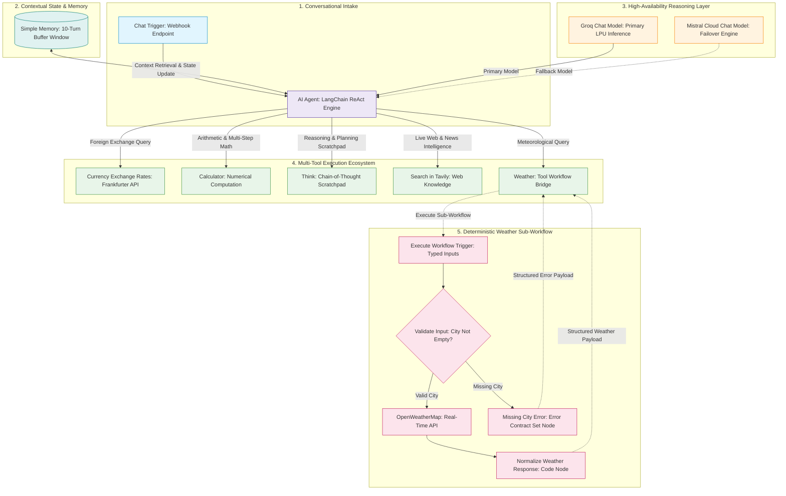
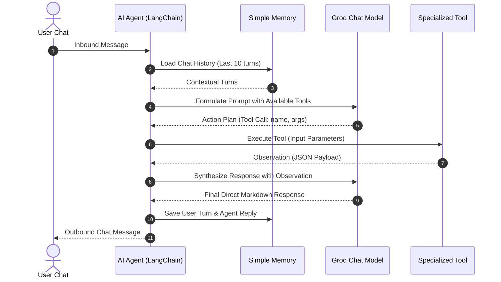

# System Architecture & Design Principles

This document provides a comprehensive architectural breakdown of the **AI Assistant Orchestrator** and its companion **Weather Information Tool** sub-workflow.

---

## 1. Architectural Overview

The system is structured as an enterprise-grade agentic workflow that pairs autonomous multi-tool reasoning with deterministic external integrations:

- **Decoupled Architecture:** The primary conversational reasoning engine (LangChain ReAct agent) is completely decoupled from external tool implementations.
- **Sub-Workflow Delegation:** Complex external integrations (like OpenWeatherMap) are encapsulated within dedicated sub-workflows, ensuring that parameter validation, upstream error capture, and data normalization occur independently of the main canvas.
- **Zero Hallucination Grounding:** System directives strictly mandate that factual figures (weather metrics, foreign exchange rates, mathematical totals) must be acquired via tools rather than fabricated by LLM weights.
- **High-Availability Failover:** The orchestrator features a dual-model configuration where a sub-second primary model (`Groq openai/gpt-oss-120b`) is backed by a resilient enterprise fallback model (`Mistral Cloud mistral-medium-3.5`).

---

## 2. End-to-End System Architecture

---

## 3. ReAct Agent Execution Loop

The **AI Agent** operates on a **Reasoning + Acting (ReAct)** paradigm:

---

## 4. Multi-Model Resilience & Failover Strategy

To eliminate single points of failure (SPOF):

1. **Primary Model (Groq - `openai/gpt-oss-120b`):**
   - Engineered for sub-second inference latency (~400–600 ms).
   - Handles multi-turn tool selection and JSON argument extraction.
2. **Fallback Model (Mistral Cloud - `mistral-medium-3.5`):**
   - Wired via `ai_languageModel` index 1 with `needsFallback: true`.
   - Automatically takes over reasoning if Groq encounters:
     - Rate-limit thresholds (HTTP 429).
     - Transient cloud outages (HTTP 500/503).
     - Extended context window saturation.

---

## 5. Conversational Memory Management

- **Node Type:** `@n8n/n8n-nodes-langchain.memoryBufferWindow`
- **Window Size:** 10 conversational turns (`contextWindowLength: 10`).
- **Session Isolation:** Keyed automatically by n8n's incoming `sessionId`, ensuring that distinct client sessions maintain independent histories without cross-talk or state leakage.

---

## 6. Sub-Workflow Encapsulation Pattern

Rather than cluttering the primary agent canvas with API formatting nodes, the weather integration is encapsulated in an autonomous sub-workflow:
1. **Contract Independence:** The sub-workflow exposes typed inputs (`city`, `country_code`, `units`) and always returns a consistent JSON schema (`{ success, city, country, temperature, feels_like, humidity, condition, wind_speed, units }`).
2. **Elimination of Intermediate LLMs:** The sub-workflow utilizes deterministic JavaScript (`Code` node) to parse and normalize the weather payload, reducing latency and operational API costs.
3. **Isolated Error Boundaries:** Upstream OpenWeatherMap errors (such as 404 City Not Found) are converted into structured `{ success: false, error: "..." }` responses, preventing orchestrator canvas crashes.
