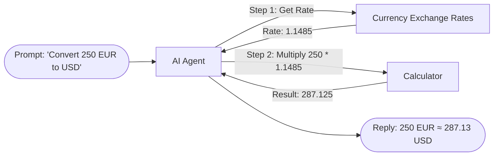

# Tool Routing & Domain Separation Guardrails

This document details the tool selection mechanics, dynamic `$fromAI()` schema bindings, and anti-overlap guardrails implemented in the **AI Assistant Orchestrator**.

---

## 1. Tool Routing Philosophy

Autonomous agents frequently encounter tool ambiguity when multiple connected tools possess overlapping capabilities. For example:
- A user asks: *"What is the exchange rate for USD to EUR?"*
- Without explicit guardrails, the agent might invoke a web search engine (`Search in Tavily`) rather than the authoritative financial API (`Currency Exchange Rates`).
- Web search introduces latency (~2–4s), non-standard response text, and potential inaccuracies from stale articles.

To solve this, the orchestrator implements a **dual-layer routing defense**:
1. **System-Level Priority Hierarchy:** Explicitly ranking tools in the system instructions.
2. **Negative Tool Constraints:** Embedding negative instructions into general-purpose tool descriptions.

---

## 2. Tool Routing Matrix

| Tool Name | Domain / Action | Primary Trigger Condition | Disallowed Alternatives |
| :--- | :--- | :--- | :--- |
| **`Currency Exchange Rates`** | Foreign Exchange & Conversions | Currency conversion, exchange rate lookup between ISO codes. | `Search in Tavily` |
| **`Calculator`** | Arithmetic Computation | Multiplications, sums, percentages, financial compounding. | Pure LLM calculation |
| **`Weather`** | Real-time Meteorology | City weather conditions, temperature, humidity, wind speed. | `Search in Tavily` |
| **`Search in Tavily`** | General Web Knowledge | Recent news, sports results (e.g. FIFA World Cup), facts. | `Weather`, `Currency Exchange Rates` |
| **`Think`** | Internal Scratchpad | Multi-step problem decomposition, strategy formulation. | Premature execution |

---

## 3. Dynamic Parameter Binding via `$fromAI()`

Tools communicate their required input schema to the LLM via n8n's `$fromAI()` function:

### Currency Exchange Rates
```javascript
https://api.frankfurter.dev/v2/rate/${$fromAI('from_currency', 'Three-letter currency code to convert from, e.g. USD, EUR, GBP', 'string').toUpperCase().trim()}/${$fromAI('to_currency', 'Three-letter currency code to convert to, e.g. EUR, USD, JPY', 'string').toUpperCase().trim()}
```
- **Guaranteed ISO Codes:** The LLM receives structured parameter descriptions requesting 3-letter codes.
- **Runtime Normalization:** `.toUpperCase().trim()` sanitizes lowercase inputs (e.g. `"usd"` ➔ `"USD"`).

### Weather Sub-Workflow
```json
{
  "city": "={{ $fromAI('city', 'The name of the city, e.g. London or Tokyo', 'string') }}",
  "country_code": "={{ $fromAI('country_code', 'Optional two-letter ISO country code, e.g. US, GB, FR', 'string') }}",
  "units": "={{ $fromAI('units', 'Units of measurement: metric or imperial (default: metric)', 'string') }}"
}
```

---

## 4. Anti-Overlap Guardrails

To prevent `Search in Tavily` from hijacking domain-specific queries:

```json
{
  "descriptionType": "manual",
  "toolDescription": "Search the web for current events, news, or general web information. Do NOT use for weather or currency exchange rates, as dedicated tools exist for those."
}
```

### Routing Impact:
- **Query:** *"What is the exchange rate from USD to EUR?"*  
  ➔ Evaluates Tavily: **Rejected** (Violates negative instruction).  
  ➔ Evaluates Currency Exchange Rates: **Selected** (Exact match).  
- **Query:** *"Who won the 2026 FIFA World Cup, and what was the final score?"*  
  ➔ Evaluates Currency / Weather: **Rejected** (Out of domain).  
  ➔ Evaluates Tavily: **Selected** (Current events / web search).

---

## 5. Chained Execution Patterns

The agent seamlessly coordinates multi-tool chains across complex inquiries:


