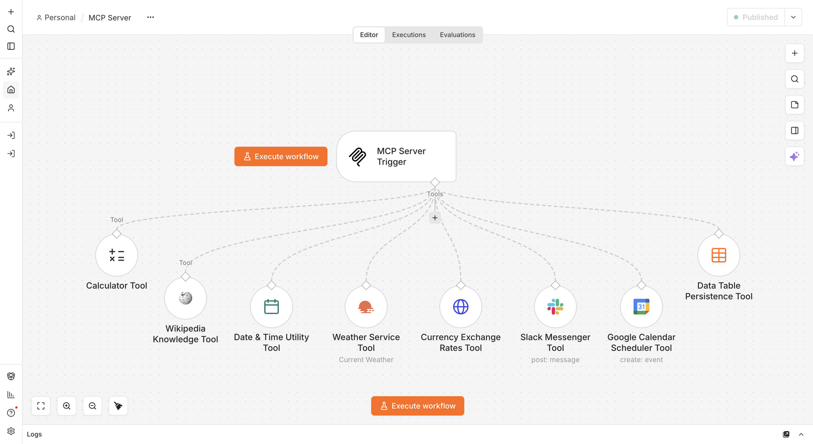
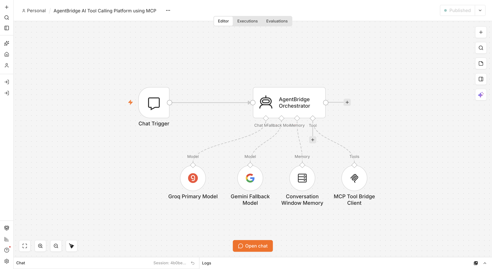
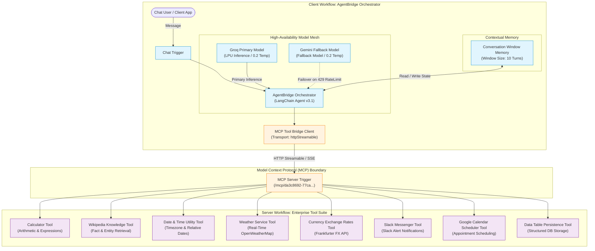

# AgentBridge: AI Tool Calling Platform using Model Context Protocol (MCP)


-0052CC?style=for-the-badge)
-F55036?style=for-the-badge&logo=groq&logoColor=white)
-4285F4?style=for-the-badge&logo=google&logoColor=white)


An enterprise-grade **AI Tool Calling Platform** architected on the open **Model Context Protocol (MCP)** specification. AgentBridge decouples high-level autonomous agent reasoning from underlying integration execution, featuring dual-model high-availability failover (Groq primary + Google Gemini fallback), a 10-turn memory buffer, and an extensible suite of 8 production tools (Arithmetic, Wikipedia Knowledge, Timezone Date/Time, Live Weather, Forex Rates, Slack Notifications, Google Calendar Scheduling, and Data Table Persistence).

---

## Executive Summary

Traditional AI agent implementations bundle third-party tools directly into the agent's canvas or code. In enterprise production environments, this monolithic design pattern introduces significant friction:
1. **Coupled Blast Radius:** A minor credential rotation or schema change in a single integration tool requires redeploying and risking the entire reasoning engine.
2. **Zero Tool Portability:** Tools created for one agent cannot easily be shared with other workflows, developer environments, or external client agents (such as Claude Desktop or custom SDKs).
3. **High Latency & Single-Provider Failure:** Workflows tied to a single LLM provider crash when rate limits or upstream API latency spikes occur.

**AgentBridge** resolves this by separating the system into a **Standardized Tool Server** and an **Autonomous Agent Client**:
- **Workflow 1 (MCP Server):** Exposes 8 enterprise tools via standardized JSON-RPC schemas over HTTP streamable transport (`/mcp/...`).
- **Workflow 2 (AgentBridge Client):** An autonomous LangChain orchestrator with multi-turn memory that dynamically discovers, validates, and invokes tools over MCP while maintaining resilient failover between Groq and Gemini.

---

## Visual Demonstrations

### 1. Interactive Multi-Tool Execution & Resilient Failover
Live interactive chat demonstrating the agent dynamically selecting, validating, and executing tools over the Model Context Protocol, featuring automatic failover resilience:
- **Direct Conversational Inquiry:** *"Hello! What operations can you help me perform?"* ➔ The agent answers directly with a structured summary of its available capabilities without unnecessary tool invocations.
- **Timezone-Aware Resolution:** *"What is the current time in Tokyo?"* ➔ Dynamically calls `Date & Time Utility Tool` via MCP with the `Asia/Tokyo` timezone parameter to format the current local time.
- **Foreign Exchange Conversion:** *"How much is 120 EUR in GBP?"* ➔ Dispatches to `Currency Exchange Rates Tool` via MCP to fetch real-time spot FX rates.
- **Seamless Model Failover in Action:** In the final seconds of the conversation, when the primary model (Groq) encounters an on-demand token rate limit, the orchestrator automatically catches the error and hands off execution to the secondary model (**Google Gemini**) without interrupting the session, failing, or breaking the conversational flow.


---

### 2. MCP Server Canvas
Canvas overview of **Workflow 1: MCP Server** hosting 8 production tools wired directly into the MCP Server Trigger:



---

### 3. AgentBridge AI Client Canvas
Canvas overview of **Workflow 2: AgentBridge Client** showing Chat Trigger, LangChain Orchestrator, Redundant Model Mesh (Groq + Gemini), Memory Window, and MCP Client Tool:



---

## 🏗️ System Architecture



---

## 🛠️ MCP Tool Ecosystem & Routing Matrix

The MCP Server exposes 8 decoupled tools with explicit parameter contracts and input validation:

| Tool Name | Technology | Input Parameters | Primary Purpose | Validation & Safeguards |
| :--- | :--- | :--- | :--- | :--- |
| **`Calculator Tool`** | LangChain Calculator | `input` | Arithmetic, percentages, exponents, and multi-step expressions. | Requires clean mathematical expressions; eliminates LLM calculation errors. |
| **`Wikipedia Knowledge Tool`** | LangChain Wikipedia | `input` | Encyclopedic entity lookups, historical background, and scientific concepts. | Enforces concise, single-topic query terms. |
| **`Date & Time Utility Tool`** | `dateTimeTool` | `timezone` *(optional, default UTC)* | Current date, time, and day of week resolution across global timezones. | Accepts IANA timezone strings (`America/New_York`, `Asia/Tokyo`). |
| **`Weather Service Tool`** | `openWeatherMapTool` | `city`, `country_code` *(optional)*, `language` *(optional)* | Live meteorological conditions, temperatures, humidity, and wind. | Dynamic country code concatenation (`city,country_code`) for location disambiguation. |
| **`Currency Exchange Rates Tool`** | `httpRequestTool` (Frankfurter) | `from_currency`, `to_currency`, `amount` *(default 1)* | Real-time foreign exchange rates and instant currency conversion. | Normalized 3-letter ISO codes; includes `neverError: true` to prevent workflow crashes. |
| **`Slack Messenger Tool`** | `slackTool` | `channel` *(default #ai-support-automation)*, `message` | Instant alerts and notifications into designated team channels. | Supports Slack markdown formatting (links, bold, codeblocks). |
| **`Google Calendar Scheduler Tool`** | `googleCalendarTool` | `title`, `start`, `end`, `description` *(opt)*, `timezone` *(opt)* | Autonomous event creation and calendar scheduling. | Enforces ISO 8601 timestamps and calendar ID validation. |
| **`Data Table Persistence Tool`** | `dataTableTool` | `table_id`, `title`, `category`, `data`, `metadata` | Persistent audit logging and record storage inside n8n internal tables. | Generic structured schema preserving classification metadata. |

---

## Autonomous Agent Protocol & Prompt Engineering

The orchestrator runs on a strict operational protocol configured in the system prompt:

1. **Direct Answer Protocol:**
   - General conversation, explanations, architectural comparisons, code writing, or reasoning queries that do not require external state are answered **directly** without calling any MCP tools.
2. **Tool Invocation Protocol:**
   - Whenever external data, calculation, messaging, scheduling, or persistence is required, the agent **must** invoke the corresponding MCP tool.
3. **Parameter Discipline:**
   - The LLM extracts and validates required parameters before dispatching tool calls. Ambiguous dates or missing parameters trigger polite user clarification requests instead of hallucinations.
4. **Resilient Error Recovery:**
   - If a tool fails, times out, or returns a rate limit, the agent catches the condition gracefully, explaining the situation in clear language with actionable next steps rather than exposing raw stack traces.

---

## Live Verification Benchmarks

| Metric | Execution #272 (Math) | Execution #280 (Forex) | Benchmark Target |
| :--- | :--- | :--- | :--- |
| **User Input** | `"What is 45 * 12 + 100?"` | `"Convert 50 USD to EUR"` | Real-world conversational queries |
| **Tool Called** | `Calculator Tool` | `Currency Exchange Rates Tool` | 100% Deterministic Tool Match |
| **Tool Arguments** | `{"input": "45 * 12 + 100"}` | `{"amount": 50, "from_currency": "USD", "to_currency": "EUR"}` | Zero Hallucinated Parameters |
| **Server Response** | `640` | `[{"amount": 50, "rates": {"EUR": 43.987}}]` | Validated API Payloads |
| **Agent Output** | `45 × 12 + 100 = 640` | `50 USD is approximately 43.99 EUR` | Formatted Markdown Synthesis |
| **End-to-End Latency** | **1.40s** | **1.46s** | < 2.50s |
| **Execution Status** | ✅ **Success** | ✅ **Success** | Zero Unhandled Crashes |

---

## Quickstart & Setup Guide

### 1. Prerequisites
- **n8n Instance:** Version 1.70+ with LangChain and MCP node support.
- **Groq API Key:** For primary high-speed LPU inference (`groqApi`).
- **Google Gemini API Key:** For secondary failover inference (`googlePalmApi`).
- **Integration Credentials:** OpenWeatherMap API, Slack OAuth/Bot Token, Google Calendar OAuth2.

### 2. Import Workflows
1. Import **Workflow 1**: [`workflows/01-mcp-server.json`](workflows/01-mcp-server.json) into n8n.
   - Verify tool credentials (OpenWeatherMap, Slack, Google Calendar).
   - Click **Publish** to activate the MCP Server endpoint.
2. Import **Workflow 2**: [`workflows/02-agentbridge-platform.json`](workflows/02-agentbridge-platform.json) into n8n.
   - In `MCP Tool Bridge Client`, confirm the `endpointUrl` matches Workflow 1's path (`http://localhost:5678/mcp/<webhookId>`).
   - Assign your Groq and Google Gemini credentials.

### 3. Verification
Open the **Chat** panel in Workflow 2 and submit:
```text
Convert 50 USD to EUR and tell me what the current time is in Tokyo.
```
The agent will sequentially invoke the `Currency Exchange Rates Tool` and `Date & Time Utility Tool` via MCP, synthesizing the combined results into a single structured response.

---

## 📁 Repository Structure

```text
04-agentbridge-ai-tool-calling-platform-using-mcp/
├── README.md                           # Main architectural documentation & benchmarks
├── workflows/
│   ├── 01-mcp-server.json              # Sanitized export of Workflow 1 (MCP Server)
│   └── 02-agentbridge-platform.json    # Sanitized export of Workflow 2 (Agent Client)
├── docs/
│   ├── architecture.md                 # Protocol specification & failover mechanics
│   ├── mcp-tools-specification.md      # Exhaustive parameter reference for all 8 tools
│   └── testing-and-verification.md     # Benchmark execution traces & test proofs
└── assets/
    └── README.md                       # Media placement guide for GIFs & screenshots
```

---

## Author

**Ravi Rai**
- GitHub: [@theravirai](https://github.com/theravirai)
- Repository: [ai-automation-workflows](https://github.com/theravirai/ai-automation-workflows)
