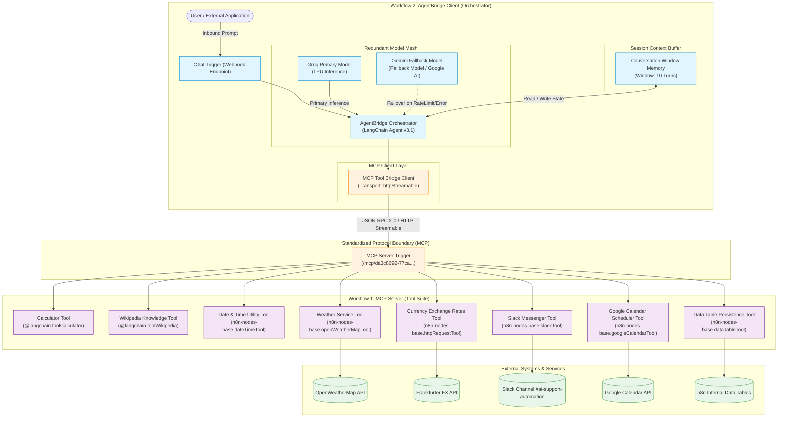

# AgentBridge System Architecture & Protocol Specification

## 1. Architectural Overview

**AgentBridge** is an enterprise-grade AI tool-calling architecture designed around the open **Model Context Protocol (MCP)** specification. It decouples generative AI reasoning from the operational execution of integration tools and external APIs.

---

## 2. Key Engineering Principles

### A. Decoupled Tool Infrastructure (Client-Server Separation)
In legacy architectures, AI agents directly embed tool nodes inside a single monolithic workflow canvas. This introduces several major failure points:
- **Blast Radius:** A configuration or credential failure in one tool can halt the entire orchestrator.
- **Limited Reusability:** Other workflows, IDEs, or external AI agents (such as Claude Desktop, Windsurf, or custom Python agents) cannot reuse the tool definitions.
- **Deployment Lock-in:** Updating a tool's API endpoints forces touching the AI Agent's sensitive system prompt and reasoning nodes.

AgentBridge solves this by hosting all tool implementations inside a dedicated **MCP Server workflow** (`cRYsSGBxbZqLzZ2c`). External clients connect via the standard Model Context Protocol over HTTP streamable transport.

### B. High-Availability LLM Failover Mesh
Large Language Models operating on on-demand tiers frequently hit token-per-minute (TPM) or request-per-minute (RPM) limits during enterprise workloads. 
- **Primary Inference:** **Groq Primary Model** provides ultra-fast generation latency (~400ms per tool invocation cycle).
- **Secondary Failover:** **Google Gemini Fallback Model** is wired directly to index 1 of the agent's language model inputs with `needsFallback: true`.
- When Groq throws an HTTP `429 (RateLimitError)`, the LangChain agent automatically catches the exception and retries the exact context against Gemini without dropping user sessions or throwing workflow crashes.

### C. Conversational Memory & Multi-Turn Context
The orchestrator attaches a **Window Buffer Memory** node (`contextWindowLength: 10`) keyed to the incoming `sessionId`:
- Maintains conversational coherence across 10 complete interaction turns.
- Preserves intermediate tool execution results (such as previously calculated currency conversions or retrieved meeting dates) across consecutive questions.
- Automatically bounds token consumption to protect LLM context windows.

---

## 3. Communication Protocol (Model Context Protocol)

The integration between Workflow 1 and Workflow 2 uses standard MCP primitives:

1. **Discovery (`tools/list`):**
   When the AI Agent initializes or triggers a turn, the `MCP Tool Bridge Client` sends a discovery request to `http://localhost:5678/mcp/da3c8692-77ca-4c36-b912-568660a1983d`. The MCP Server returns the full JSON schema of all 8 exposed tools, including their descriptions, required parameters, and dynamic `$fromAI` fields.

2. **Execution (`tools/call`):**
   When the LLM decides to invoke a tool, it outputs a structured tool call (e.g., `{"name": "MCP_Tool_Bridge_Client_Currency_Exchange_Rates_Tool", "args": {"from_currency": "USD", "to_currency": "EUR", "amount": 50}}`).
   The client formats this as an MCP tool execution payload, sends it to the server endpoint, and receives back a normalized JSON array response.

3. **Streamable HTTP Transport:**
   Uses lightweight HTTP streamable framing with a 30,000ms timeout threshold, ensuring that slow third-party APIs (such as external weather feeds or Google Calendar syncs) do not freeze the parent conversational process.
