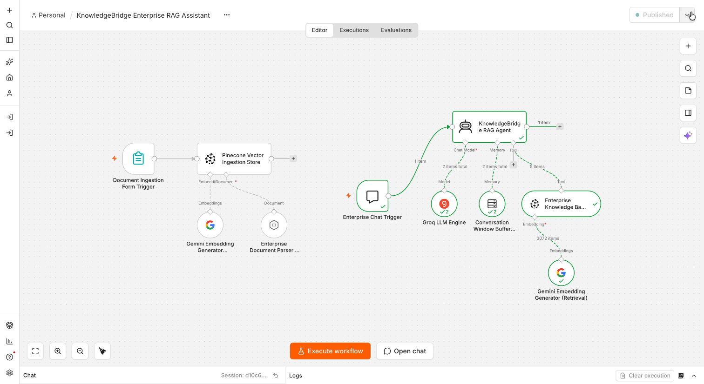
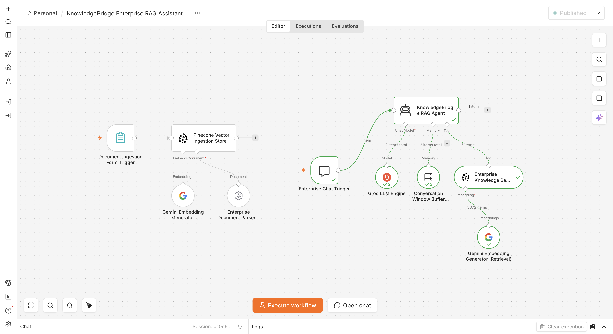
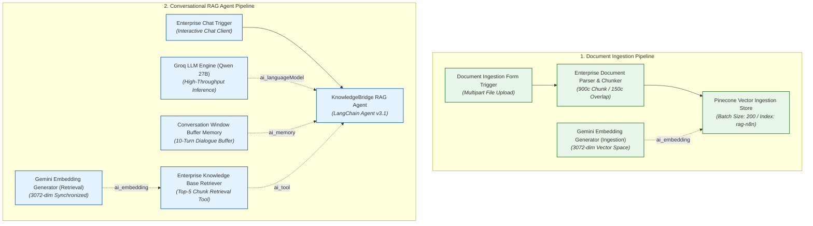

# KnowledgeBridge: Enterprise RAG Assistant


-F55036?style=for-the-badge&logo=groq&logoColor=white)

-4285F4?style=for-the-badge&logo=google&logoColor=white)
-7928CA?style=for-the-badge)


An enterprise-grade **Autonomous Knowledge Retrieval & RAG Assistant** engineered in **n8n**. KnowledgeBridge combines an asynchronous multipart document ingestion pipeline with a conversational ReAct reasoning agent, featuring dense **3072-dimensional vector indexing** in Pinecone, semantic chunking (~900 characters with 150 character overlap), a 10-turn conversation memory window, strict anti-hallucination grounding guardrails, and deterministic document title citations.

---

## Executive Summary

Enterprise knowledge bases frequently suffer from three major implementation flaws:
1. **Vector Dimension & Model Drift:** When document ingestion and real-time retrieval utilize divergent embedding models or inconsistent dimension configurations, cosine similarity fails silently.
2. **Hallucination & Speculative Completion:** Unconstrained conversational agents often invent policies, SLAs, or figures when documentation is missing or ambiguous.
3. **Context Blindness & Dialogue Fragmentation:** Without stateful memory windows, follow-up questions require users to re-state full context in every turn.

**KnowledgeBridge** resolves these operational challenges by unifying two decoupled pipelines on a single resilient canvas:
- **Phase 1: Ingestion Pipeline:** Multipart document upload form trigger, auto-detecting document loader, semantic text splitting (900c / 150o), automatic metadata injection (`title`, `source`, `category`, `uploaded_at`), and dense 3072-dimensional embedding upserts to Pinecone.
- **Phase 2: Conversational RAG Query Agent:** LangChain ReAct orchestrator powered by **Groq Qwen 27B**, an explicit 10-turn memory buffer, top-5 chunk retrieval tool, mandatory source citations (`[Source: <title>]`), and graceful fallback handling for out-of-scope inquiries.

---

## Visual Demonstrations

### 1. Interactive Enterprise RAG Query Demo
*Live interactive session showcasing multi-turn conversational inquiries, document title citations, and strict refusal on out-of-context topics:*


---

### 2. Enterprise Document Ingestion Portal
*Secure multipart upload portal ingesting policy PDFs into the 3072-dimensional Pinecone vector store:*



---

### 3. Workflow Canvas Architecture
*Complete canvas layout depicting the Document Ingestion Pipeline alongside the Conversational RAG Agent Pipeline:*



---

## 🏗️ System Architecture



---

## 🛠️ Detailed Node Specifications

| Node Name | Node Type | Version | Key Configuration | Operational Role |
| :--- | :--- | :---: | :--- | :--- |
| **`Document Ingestion Form Trigger`** | `formTrigger` | `2.6` | `Upload File` (binary file input) | Web-based intake portal for ingesting enterprise policy and architecture documents. |
| **`Enterprise Document Parser & Chunker`** | `documentDefaultDataLoader` | `1.1` | `chunkSize: 900`, `chunkOverlap: 150`, `loader: auto` | Parses binary documents and generates ~900 character chunks with preserved metadata fields. |
| **`Gemini Embedding Generator (Ingestion)`** | `embeddingsGoogleGemini` | `1.0` | `modelName: models/gemini-embedding-001` | Generates dense 3072-dimensional vector embeddings for uploaded document chunks. |
| **`Pinecone Vector Ingestion Store`** | `vectorStorePinecone` | `1.3` | `mode: insert`, `pineconeIndex: rag-n8n`, `batchSize: 200` | Upserts embedded vectors and document metadata into the Pinecone index. |
| **`Enterprise Chat Trigger`** | `chatTrigger` | `1.4` | `options: {}` | Dispatches real-time user inquiries and session IDs to the conversational agent. |
| **`KnowledgeBridge RAG Agent`** | `agent` | `3.1` | Strict grounding prompt, `autoSaveHighlightedData: true` | ReAct reasoning orchestrator evaluating queries, invoking retrieval, and enforcing citations. |
| **`Groq LLM Engine (Qwen 27B)`** | `lmChatGroq` | `1.0` | `model: qwen/qwen3.8-27b` | High-throughput reasoning and context synthesis model. |
| **`Conversation Window Buffer Memory`** | `memoryBufferWindow` | `1.4` | `contextWindowLength: 10`, `sessionIdType: fromInput` | Retains the previous 10 dialogue interactions for seamless follow-up questions. |
| **`Enterprise Knowledge Base Retriever`** | `vectorStorePinecone` | `1.3` | `mode: retrieve-as-tool`, `topK: 5`, `includeMetadata: true` | Tool enabling the LLM to query the Pinecone vector index for relevant context. |
| **`Gemini Embedding Generator (Retrieval)`** | `embeddingsGoogleGemini` | `1.0` | `modelName: models/gemini-embedding-001` | Generates matching 3072-dimensional query vectors for similarity comparison. |

---

## 📄 Ingestion & Chunking Specification

Knowledge documents ingested into KnowledgeBridge undergo deterministic preprocessing:
- **Chunk Size:** `900` characters (~180–225 tokens), optimal for granular policy and technical clauses.
- **Chunk Overlap:** `150` characters (~30–40 tokens), preventing sentence boundary truncation.
- **Injected Metadata Schema:**
  ```json
  {
    "title": "={{ $binary.Upload_File.fileName || 'Untitled Document' }}",
    "source": "={{ $binary.Upload_File.fileName || 'Direct Upload' }}",
    "category": "enterprise_docs",
    "uploaded_at": "={{ $now.toISO() }}"
  }
  ```

For full mathematical and vector indexing details, see the [Vector Retrieval & Chunking Specification](docs/vector-retrieval-and-chunking.md).

---

## Anti-Hallucination & Grounding Guardrails

The **KnowledgeBridge RAG Agent** operates under strict system prompt constraints:
1. **Strict Context Bounding:** Only facts explicitly present in retrieved chunks may be included in the answer.
2. **Deterministic Citations:** Answers must cite the originating document title using the format `[Source: <title>]`.
3. **Zero-Hallucination Fallback:** When the retrieved context is insufficient or off-topic, the agent responds with:
   > *"I could not find relevant information regarding your request in the enterprise knowledge base."*
4. **Execution Tracing:** Every execution records structured metadata:
   - `question`: Captured from `$json.chatInput`
   - `model`: `qwen/qwen3.8-27b`
   - `timestamp`: UTC ISO timestamp
   - `workflow`: `KnowledgeBridge Enterprise RAG Assistant`

---

## 🧪 Sample Documents & Verification Walkthrough

The [`sample-documents/`](sample-documents/) directory contains 3 realistic enterprise PDF documents ready for initial ingestion:

1. **`01-enterprise-ai-governance-and-acceptable-use-policy.pdf`**: Covers approved model registries, PII masking rules, RAG grounding, and escalation thresholds.
2. **`02-cloud-infrastructure-sla-and-security-standards.pdf`**: Covers 99.99% uptime SLAs, 3072-dim Pinecone configuration, AES-256 KMS encryption, and disaster recovery.
3. **`03-remote-work-security-and-employee-benefits-guide.pdf`**: Covers home office setup stipends ($1,500), parental leave (16 weeks), and professional development budgets.

### Testing Queries via Chat Trigger:
```text
Query 1: "What AI models are approved for production use in our organization, and what are our PII masking requirements?"
Response: Cites approved models (Groq Llama-3.3-70B, Qwen-2.5-32B, Gemini-1.5, Claude 3.5 Sonnet) and deterministic PII masking rules [Source: 01-enterprise-ai-governance-and-acceptable-use-policy.pdf].

Query 2: "What is our monthly cloud uptime SLA target, and how is our Pinecone vector database configured?"
Response: Cites 99.99% monthly infrastructure SLA, 3072-dimensional dense vector space, and Cosine metric [Source: 02-cloud-infrastructure-sla-and-security-standards.pdf].

Query 3: "How much is the home office setup stipend, and what is our parental leave policy?"
Response: Details the $1,500 one-time home office reimbursement and 16 weeks of paid parental leave [Source: 03-remote-work-security-and-employee-benefits-guide.pdf].

Query 4: "Does the company provide corporate car allowances or pet relocation coverage?"
Response: "I could not find relevant information regarding your request in the enterprise knowledge base." (Strict anti-hallucination guardrail).
```

---

## Setup & Deployment Guide

### Prerequisites
- Self-hosted or Cloud **n8n** instance (v1.40+).
- **Pinecone Account:** An index named `rag-n8n` configured with **Metric: `cosine`** and **Dimensions: `3072`**.
- **Groq API Key:** Access to `qwen/qwen3.8-27b` or `llama-3.3-70b-versatile`.
- **Google Gemini API Key:** Generative AI / PaLM API key for embeddings.

### Installation
1. Import [`workflows/knowledgebridge-enterprise-rag-assistant.json`](workflows/knowledgebridge-enterprise-rag-assistant.json) into n8n.
2. Connect your **Pinecone**, **Groq**, and **Google Gemini** credentials.
3. Verify that your Pinecone index dimension is set to **`3072`**.
4. Open the **Document Ingestion Form Trigger** and upload the sample PDFs from `sample-documents/`.
5. Open the **Enterprise Chat Trigger** canvas test window to begin interactive Q&A.

---

## Author & License

- **Author:** Ravi Rai ([@theravirai](https://github.com/theravirai))
- **Repository:** [ai-automation-workflows](https://github.com/theravirai/ai-automation-workflows)
- **License:** MIT
