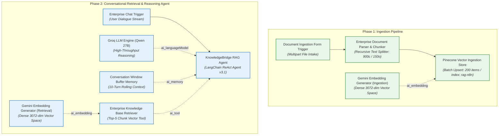
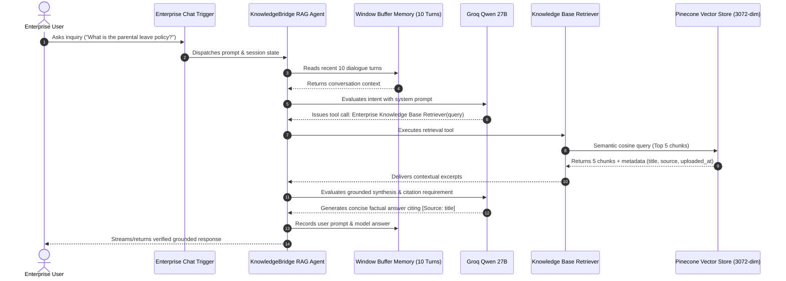

# System Architecture: KnowledgeBridge Enterprise RAG Assistant

## 1. Architectural Philosophy & Design Principles

**KnowledgeBridge** is designed around a clean separation of concerns between **Continuous Knowledge Ingestion** and **Autonomous Context-Grounded Reasoning**. In enterprise environments, document lifecycles are asynchronous and decoupled from real-time user query traffic.

To ensure production resilience, scalability, and strict compliance, KnowledgeBridge adheres to four architectural pillars:



---

## 2. Ingestion Pipeline Mechanics

The ingestion pipeline transforms raw unstructured documents (PDFs, TXT, DOCX, Markdown) into dense mathematical vectors enriched with organizational metadata.

### Step 1: Document Intake (`Document Ingestion Form Trigger`)
- **Node Type:** `n8n-nodes-base.formTrigger`
- **Payload:** Accepts binary file uploads (`Upload File`) through a web form interface or automated curl/API POST endpoints.
- **Contract:** Passes binary stream metadata (`$binary.Upload_File`) containing `fileName`, `fileSize`, and `mimeType`.

### Step 2: Parsing & Semantic Chunking (`Enterprise Document Parser & Chunker`)
- **Node Type:** `@n8n/n8n-nodes-langchain.documentDefaultDataLoader`
- **Chunk Geometry:**
  - **Chunk Size:** ~900 characters (~180-220 tokens). This size provides sufficient semantic context for a single policy clause or technical specification without diluting similarity search vectors.
  - **Chunk Overlap:** ~150 characters (~30-40 tokens). Prevents semantic boundary truncation by repeating trailing sentences across adjacent chunks.
- **Metadata Preservation:**
  ```javascript
  {
    "title": "={{ $binary.Upload_File.fileName || 'Untitled Document' }}",
    "source": "={{ $binary.Upload_File.fileName || 'Direct Upload' }}",
    "category": "enterprise_docs",
    "uploaded_at": "={{ $now.toISO() }}"
  }
  ```

### Step 3: High-Dimensional Dense Embedding (`Gemini Embedding Generator`)
- **Node Type:** `@n8n/n8n-nodes-langchain.embeddingsGoogleGemini`
- **Embedding Model:** `models/gemini-embedding-001`
- **Output Dimensionality:** **3072 dimensions**.
- **Vector Space Consistency:** Guarantees that vectors generated during ingestion reside in the exact mathematical subspace as queries formulated during conversational retrieval.

### Step 4: Vector Indexing (`Pinecone Vector Ingestion Store`)
- **Node Type:** `@n8n/n8n-nodes-langchain.vectorStorePinecone` (Mode: `insert`)
- **Target Index:** `rag-n8n`
- **Batch Processing:** Processes up to 200 chunks per transaction (`embeddingBatchSize: 200`) to respect API throughput limits while maximizing ingestion speed.

---

## 3. Conversational RAG Query Agent

The retrieval agent operates as an autonomous ReAct reasoning loop bounded by strict grounding directives.



---

## 4. Anti-Hallucination & Grounding Guardrails

Enterprise RAG applications require deterministic boundaries against fabricated facts. KnowledgeBridge enforces this through five discrete layers:

1. **System Prompt Bounding:** The agent is instructed to consider *only* retrieved passages as ground truth. Speculative completion is explicitly prohibited.
2. **Missing Context Fallback:** If retrieval similarity scores fall below threshold or return empty sets, the agent must output:
   > *"I could not find relevant information regarding your request in the enterprise knowledge base."*
3. **Mandatory Metadata Citations:** Whenever statements are made from retrieved text, the agent must cite the source document title using the format `[Source: <title>]`.
4. **Context Window Isolation:** A 10-turn memory buffer prevents conversation drift and hallucination compounding across extended sessions.
5. **Observability Tracing:** Every execution automatically captures structured tracing metadata (`question`, `model`, `timestamp`, `workflow`) for downstream auditing and evaluation.
