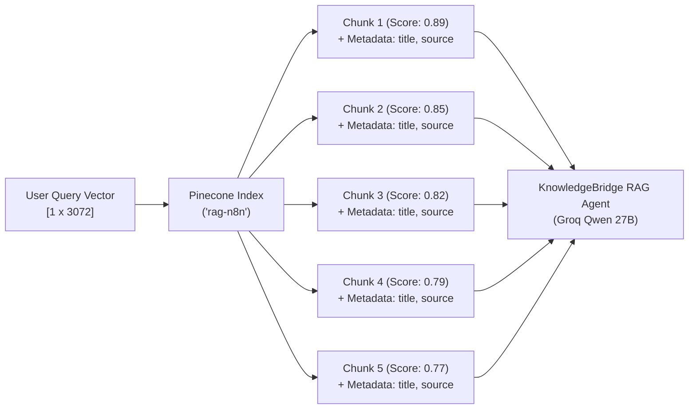

# Vector Retrieval & Semantic Chunking Specification

This document details the mathematical, chunking, and metadata engineering principles implemented in **KnowledgeBridge: Enterprise RAG Assistant**.

---

## 1. Chunking Geometry & Mathematical Rationale

In high-accuracy enterprise RAG, chunking directly impacts retrieval recall and precision:
- **Too Large (>2000 chars):** Chunks combine multiple disparate ideas, diluting similarity embeddings and causing vector search to miss specific clauses.
- **Too Small (<300 chars):** Chunks fragment sentences, stripping away the context necessary for the LLM to understand dependencies or exceptions.

KnowledgeBridge uses a tuned **recursive character chunking strategy**:

| Parameter | Value | Token Equivalent | Engineering Rationale |
| :--- | :--- | :--- | :--- |
| **`chunkSize`** | `900` characters | ~180 – 225 tokens | Ideal size for a single enterprise policy rule, SLA clause, or architectural specification. |
| **`chunkOverlap`** | `150` characters | ~30 – 40 tokens | Ensures that sentences spanning chunk boundaries are preserved completely in at least one chunk. |
| **`loader`** | `auto` | Dynamic | Automatically detects and extracts text from PDFs, text files, Markdown, and Word documents. |
| **`textSplittingMode`** | `simple` | Native | Employs recursive separators (`\n\n`, `\n`, ` `, `""`) to split on natural paragraph boundaries first. |

---

## 2. Document Metadata Injection Schema

During ingestion, the **Enterprise Document Parser & Chunker** injects structured metadata fields into every generated vector object. This metadata travels through the embedding pipeline into Pinecone and is returned to the agent during similarity search.

```json
{
  "metadata": {
    "title": "={{ $binary.Upload_File.fileName || 'Untitled Document' }}",
    "source": "={{ $binary.Upload_File.fileName || 'Direct Upload' }}",
    "category": "enterprise_docs",
    "uploaded_at": "={{ $now.toISO() }}"
  }
}
```

### Purpose of Metadata Fields:
1. **`title`**: Enables the agent to generate human-readable source citations (`[Source: 01-enterprise-ai-governance-and-acceptable-use-policy.pdf]`).
2. **`source`**: Identifies the ingestion origin (e.g., direct form upload, automated webhook, or scheduled sync).
3. **`category`**: Facilitates namespace or metadata filtering across corporate departments (e.g., `legal`, `hr`, `devops`).
4. **`uploaded_at`**: Provides auditability and enables future time-decay or recency-weighted re-ranking algorithms.

---

## 3. Vector Space & Embedding Consistency

### The 3072-Dimensional Dense Vector Space
```text
Raw Query / Document Text
       │
       ▼
Google Gemini Embeddings (models/gemini-embedding-001)
       │
       ▼
Dense Float32 Array [3072 elements]
[-0.0320, 0.0279, 0.0187, -0.0740, ... , 0.1702]
       │
       ▼
Cosine Distance Search in Pinecone Index ('rag-n8n')
```

### Critical Vector Synchronization Rule
- **Ingestion Generator:** `Gemini Embedding Generator (Ingestion)` $\to$ `models/gemini-embedding-001` (3072 dimensions)
- **Retrieval Generator:** `Gemini Embedding Generator (Retrieval)` $\to$ `models/gemini-embedding-001` (3072 dimensions)
- **Vector Store Index:** `Pinecone ('rag-n8n')` $\to$ Metric: `cosine`, Dimensions: `3072`

> [!WARNING]
> If the embedding model or dimension parameter differs between ingestion and retrieval by even a single dimension (e.g., 768 vs 3072), Pinecone will reject queries with a `NodeApiError: Vector dimension mismatch` or return meaningless cosine similarity scores.

---

## 4. Top-K Retrieval Dynamics

The **Enterprise Knowledge Base Retriever** tool is configured with:
- **`topK: 5`**: Retrieves the 5 highest-ranking semantic chunks per user inquiry.
- **`includeDocumentMetadata: true`**: Passes the full metadata payload along with the chunk's text to the LLM context window.


