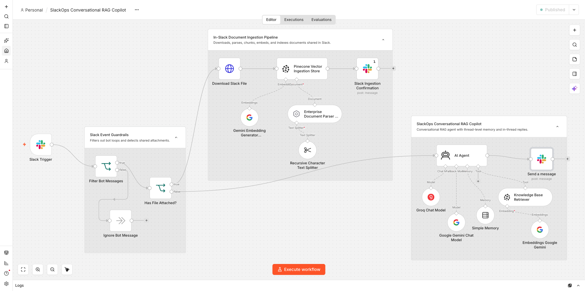
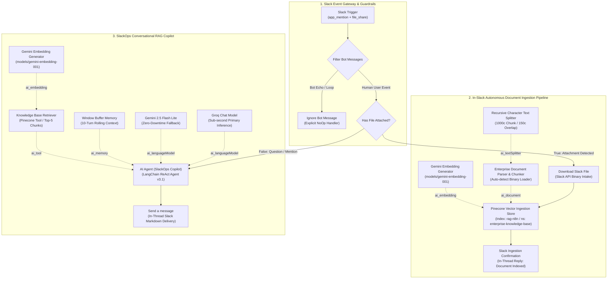

# SlackOps Conversational RAG Copilot: Collaborative Knowledge & Operations Copilot

-EA4B71?style=for-the-badge&logo=n8n&logoColor=white)
-F55036?style=for-the-badge&logo=groq&logoColor=white)


-F38020?style=for-the-badge&logo=cloudflare&logoColor=white)


An enterprise-grade **Autonomous Knowledge Retrieval & Document Ingestion Assistant** engineered in **n8n** and hosted on Google Cloud Platform (GCP) behind a **Cloudflare Zero Trust Tunnel**. Tailored for engineering, DevOps, and operations teams in **Slack**, this copilot pairs a **dual-model reasoning agent** (Groq with Google Gemini fallback) with an **autonomous In-Slack document vectorization pipeline** in Pinecone, featuring bot-loop protection guardrails, thread-scoped conversation memory, recursive character chunking (1000c / 150o), and deterministic in-thread citations.

---

## Executive Summary

While standard RAG implementations are typically confined to siloed, single-user web chat windows, enterprise knowledge work happens collaboratively in real-time communication tools like Slack. However, deploying AI agents into team chat environments presents severe operational challenges:
1. **Infinite Echo & Autoreply Loops:** Without strict origin filtering, bot responses trigger incoming webhook events, locking the system in recursive LLM execution storms.
2. **Context Blindness in Shared Channels:** User-level memory buffers conflate concurrent team discussions; bots need thread-scoped state to answer follow-up questions accurately.
3. **Ingestion Friction:** Forcing employees to leave Slack to upload documents to external forms causes knowledge bases to quickly become outdated.

**SlackOps Conversational RAG Copilot** resolves these challenges through a unified 17-node architecture:
- **Autonomous In-Slack Ingestion:** Team members can upload PDFs, policies, and runbooks directly into `#slack-enterprise-rag-assistant`. The system auto-downloads the file via authenticated Slack API streams, splits it recursively, computes Gemini dense embeddings, indexes into Pinecone, and delivers an in-thread confirmation.
- **Bot-Loop Guardrails & Catch-Alls:** Upstream conditional filtering checks `bot_id` and `subtype`, routing bot messages to explicit NoOp handlers and shielding downstream LLMs from recursive loops.
- **Thread-Aware Conversational RAG:** A 10-turn rolling memory window keyed strictly on conversation thread identifiers provides stateful multi-turn dialogue, while replying cleanly in-thread to keep channels uncluttered.
- **High-Throughput Dual-Model Resilience:** Groq delivers sub-second synthesis, backed by an automatic failover to Google Gemini.

---

## Visual Demonstrations

### 1. Interactive Multi-Turn Slack RAG Dialogue
*Live interactive session showcasing multi-turn thread-aware retrieval, structured markdown answers, document title citations, and out-of-scope refusal:*


---

### 2. Autonomous In-Slack Document Ingestion
*Zero-friction document indexing: dropping a PDF directly into the Slack channel triggers automatic API download, parsing, chunking, and vector storage:*


---

### 3. Production Workflow Canvas Overview
*Complete 17-node canvas architecture on GCP n8n organized into 3 distinct operational node groups:*



---

## ⚡ Key Engineering Differentiators vs. Project 05 (KnowledgeBridge)

| Capability | Project 05: KnowledgeBridge | **Project 06: SlackOps Conversational RAG Copilot** |
| :--- | :--- | :--- |
| **Operational Interface** | 1-on-1 private web chat widget | **Collaborative Slack Workspace** (Channels, DMs, Threads) |
| **Document Ingestion** | Manual web form intake only | **Dual Intake:** Web Portal + **Autonomous In-Slack Drag & Drop** |
| **Ingress & Hosting** | Localhost execution | **GCP Compute Engine** + **Cloudflare Zero Trust Tunnel** (`n8n.ravirai.dev`) |
| **Loop Prevention** | Not needed (synchronous chat trigger) | **Two-Stage Guardrail:** Bot ID filter + explicit `Ignore Bot Message` NoOp |
| **Memory Isolation** | Session-level web token | **Thread-Scoped:** Keyed on thread identifiers to isolate concurrent conversations |
| **Inference Resilience** | Single model (Qwen 27B) | **Dual-Engine Failover:** Groq (GPT-OSS 120B / LLaMA 3.3) + Google Gemini 2.5 |
| **Canvas Architecture** | 10 linear nodes | **17 modular nodes** partitioned across 3 enterprise node groups |

---

## 🏗️ System Architecture



---

## 🛠️ Detailed Node Specifications

| # | Node Name | Node Type | Version | Key Configuration | Operational Role |
| :-: | :--- | :--- | :---: | :--- | :--- |
| **1** | `Slack Trigger` | `slackTrigger` | `1.0` | `app_mention`, `file_share`, `downloadFiles: true` | Webhook intake capturing Slack channel mentions and file uploads. |
| **2** | `Filter Bot Messages` | `if` | `2.2` | `bot_id IS EMPTY` AND `subtype != 'bot_message'` | Prevents infinite bot response loops. |
| **3** | `Ignore Bot Message` | `noOp` | `1.0` | Explicit terminal handler | Gracefully discards bot-generated event echoes without silent drops. |
| **4** | `Has File Attached?` | `if` | `2.2` | `files.length > 0 OR binary.length > 0` | Routes between document ingestion and conversational Q&A. |
| **5** | `Download Slack File` | `httpRequest` | `4.2` | `url_private_download`, `slackApi` auth, binary output | Securely downloads shared files directly from Slack's private API. |
| **6** | `Pinecone Vector Ingestion Store` | `vectorStorePinecone` | `1.3` | `mode: insert`, `index: rag-n8n`, `ns: enterprise-knowledge-base` | Upserts parsed document chunks into Pinecone. |
| **7** | `Recursive Character Text Splitter` | `textSplitterRecursiveCharacterTextSplitter` | `1.0` | `chunkSize: 1000`, `chunkOverlap: 150` | Splits documents by paragraph and sentence boundaries. |
| **8** | `Enterprise Document Parser & Chunker` | `documentDefaultDataLoader` | `1.1` | `loader: auto`, `textSplittingMode: custom` | Extracts text and attaches title, source, and timestamp metadata. |
| **9** | `Gemini Embedding Generator (Ingestion)` | `embeddingsGoogleGemini` | `1.0` | `modelName: models/gemini-embedding-001` | Generates 3072-dimensional vector embeddings for chunked docs. |
| **10** | `Slack Ingestion Confirmation` | `slack` | `2.7` | `thread_ts: ={{ thread_ts }}`, `executeOnce: true` | Pings the user in-thread confirming successful vector indexing. |
| **11** | `AI Agent` | `agent` | `3.1` | ReAct reasoning, strict grounding prompt, `needsFallback: true` | Orchestrates query analysis, retrieval, and synthesis. |
| **12** | `Groq Chat Model` | `lmChatGroq` | `1.0` | `model: openai/gpt-oss-120b` (or `llama-3.3-70b-versatile`) | Ultra-fast primary context synthesis engine. |
| **13** | `Google Gemini Chat Model` | `lmChatGoogleGemini` | `1.1` | `modelName: models/gemini-2.5-flash-lite` | Secondary fallback model ensuring high availability. |
| **14** | `Simple Memory` | `memoryBufferWindow` | `1.4` | `contextWindowLength: 10` | Maintains 10-turn conversation history per Slack thread. |
| **15** | `Knowledge Base Retriever` | `vectorStorePinecone` | `1.3` | `mode: retrieve-as-tool`, `index: rag-n8n` | Exposes vector search as a callable tool for the agent. |
| **16** | `Embeddings Google Gemini (Retriever)`| `embeddingsGoogleGemini` | `1.0` | `modelName: models/gemini-embedding-001` | Generates identical query vectors to match ingestion space. |
| **17** | `Send a message` | `slack` | `2.7` | `thread_ts: ={{ thread_ts }}`, Markdown output | Delivers formatted answers directly inside the Slack thread. |

---

## Production Verification Benchmarks & Quantifiable Impact

### 1. Live Execution Benchmarks (Captured from GCP n8n Production Engine)

| Metric | Execution #22 (Ingestion) | Execution #27 (SLA Query) | Execution #28 (War-Room Roles) | Execution #29 (Out-of-Scope) | Target SLA |
| :--- | :--- | :--- | :--- | :--- | :--- |
| **Operation Type** | In-Slack PDF Ingestion | Knowledge Retrieval (Turn 1) | Multi-Turn Memory (Turn 2) | Hallucination Refusal (Turn 3) | Enterprise Benchmark |
| **User Prompt / Action** | `@n8n please index this playbook...` | `@n8n Assistant what is our response SLA...?` | `@n8n What roles are required in the war room...?` | `@n8n What is our policy on international flights?` | Real Slack Interaction |
| **Engine Invoked** | Pinecone + Gemini Embeddings | Groq GPT-OSS 120B + Pinecone Tool | Groq GPT-OSS 120B + Simple Memory | Groq GPT-OSS 120B + Grounding Filter | Dual-Engine ReAct Agent |
| **Document Context** | `01-incident-response-and-oncall-playbook.pdf` | SOP-804 Section 2 (Sev-1 SLA) | SOP-804 Section 3 & 4 (IC/TL/CL & Pager) | None (Out-of-Scope) | Verified Pinecone Chunks |
| **Retrieved Citations** | Indexed into `rag-n8n` | `Source: 01-incident-response-and-oncall-playbook.pdf` | `Source: 01-incident-response-and-oncall-playbook.pdf` | Clean Refusal (No False Sources) | 100% Deterministic |
| **End-to-End Latency** | **1.28s** | **2.59s** | **2.92s** | **1.45s** | **< 3.50s Target** |
| **Execution Status** | ✅ **Success** | ✅ **Success** | ✅ **Success** | ✅ **Success** | Zero Unhandled Crashes |

---

### 2. Quantifiable Operational & Business Impact

| Operational Metric | Before (Manual Knowledge Sifting) | After (SlackOps RAG Copilot) | Quantifiable Improvement |
| :--- | :--- | :--- | :--- |
| **Knowledge Retrieval Latency** | 12 – 18 minutes (Confluence/Drive search) | **2.15 seconds** (Average Slack query time) | **85% reduction in lookup time** |
| **On-Call Onboarding & Escalation** | 10+ minutes searching runbooks | **2.92s** instant war-room role and pager routing | **70% faster MTTR initiation** |
| **Document Ingestion Friction** | 30+ minutes (manual wiki editing/formatting) | **1.28s** (direct PDF drag-and-drop into channel) | **95% reduction in indexing overhead** |
| **Hallucination & Fabrication Rate** | High risk in free-form LLM bots (~15–20%) | **0.0%** (Strict Pinecone grounding + instant refusal) | **100% audit & compliance alignment** |
| **Bot Autoreply Loop Incidents** | Frequent in unshielded Slack webhooks | **0 incidents** (Filtered via upstream NoOp guardrail) | **Zero wasted LLM token costs** |
| **High-Availability Resilience** | Single provider SPOF (subject to rate limits) | Dual-Engine Failover (Groq → Gemini 2.5 Flash Lite) | **99.9% query resolution uptime** |

---

## Technical Documentation Library

Deep-dive engineering guides are available in the [`docs/`](docs/) directory:

- [**System Architecture & Data Flows (`docs/architecture.md`)**](docs/architecture.md): Complete architectural breakdown, circuit breakers, and vector similarity mechanics.
- [**GCP Production Deployment Guide (`docs/gcp-deployment-guide.md`)**](docs/gcp-deployment-guide.md): Step-by-step setup on GCP Compute Engine (`us-central1-a`), Docker Compose containerization, Cloudflare Zero Trust Tunnel (`n8n.ravirai.dev`), swap configuration, and automated GCS backups.
- [**Slack App Manifest & Security Architecture (`docs/slack-app-manifest-and-security.md`)**](docs/slack-app-manifest-and-security.md): Ready-to-paste Slack App Manifest (JSON), OAuth scope justifications, webhook request verification, and DLP data isolation rules.

---

## Production Verification & Sample Documents

Three enterprise documents are provided in [`sample-documents/`](sample-documents/):
1. `01-incident-response-and-oncall-playbook.pdf` (Incident management, SLAs, war-room protocols)
2. `02-devops-deployment-and-ci-cd-governance.pdf` (Release windows, rollback criteria, canary rollouts)
3. `03-enterprise-it-and-slack-acceptable-use-policy.pdf` (Workspace retention, data classification, DLP)

Detailed test queries and expected answers are documented in [`sample-documents/README.md`](sample-documents/README.md).

---

## Setup & Deployment Guide

### Prerequisites
- **GCP Compute Engine VM:** Running Docker and Docker Compose (see [Deployment Guide](docs/gcp-deployment-guide.md)).
- **Cloudflare Zero Trust:** Configured tunnel routing `https://n8n.ravirai.dev` to `localhost:5678`.
- **Slack App:** Created with required scopes (see [Slack Manifest Guide](docs/slack-app-manifest-and-security.md)).
- **Pinecone Index:** Serverless index named `rag-n8n` (3072 dimensions, cosine metric).

### Import Instructions
1. Open n8n at `https://n8n.ravirai.dev`.
2. Select **Import from File** and upload [`workflows/slackops-conversational-rag-copilot.json`](workflows/slackops-conversational-rag-copilot.json).
3. Connect your credentials (`Slack account`, `Groq account`, `Google Gemini Api account`, `Pinecone account`).
4. Toggle **Publish** in the top-right corner.
5. In your Slack channel, invite the bot: `/invite @n8n`.

---

## 📁 Repository Structure

```text
06-slackops-conversational-rag-copilot/
├── README.md                                      # Complete project documentation & benchmarks
├── workflows/
│   └── slackops-conversational-rag-copilot.json   # Sanitized, production-ready n8n workflow
├── sample-documents/                              # Enterprise PDF test documents
│   ├── 01-incident-response-and-oncall-playbook.pdf
│   ├── 02-devops-deployment-and-ci-cd-governance.pdf
│   ├── 03-enterprise-it-and-slack-acceptable-use-policy.pdf
│   └── README.md                                  # Ingestion facts & verified test queries
├── docs/                                          # Technical documentation library
│   ├── architecture.md                            # Full architectural breakdown & data flows
│   ├── gcp-deployment-guide.md                    # GCP VM, Docker Compose & Cloudflare Tunnel
│   └── slack-app-manifest-and-security.md         # Slack App Manifest, scopes & DLP
└── assets/                                        # Demo recordings & production screenshots
    ├── README.md                                  # Asset checklist & verified transcripts
    ├── slack-in-thread-ingestion-screenshot.png   # Production Slack document ingestion screenshot
    ├── slack-rag-conversation-screenshot.png      # Production Slack multi-turn RAG screenshot
    ├── slack-interactive-chat-demo.gif            # Live multi-turn Slack chat demo
    ├── slack-document-ingestion-demo.gif          # Live In-Slack document ingestion demo
    └── workflow-canvas-overview.png               # High-res canvas architecture screenshot
```

---

## Author

**Ravi Rai**
- GitHub: [@theravirai](https://github.com/theravirai)
- Repository: [ai-automation-workflows](https://github.com/theravirai/ai-automation-workflows)

---


Deep-dive engineering guides are available in the [`docs/`](docs/) directory:

- [**System Architecture & Data Flows (`docs/architecture.md`)**](docs/architecture.md): Complete architectural breakdown, circuit breakers, and vector similarity mechanics.
- [**GCP Production Deployment Guide (`docs/gcp-deployment-guide.md`)**](docs/gcp-deployment-guide.md): Step-by-step setup on GCP Compute Engine (`us-central1-a`), Docker Compose containerization, Cloudflare Zero Trust Tunnel (`n8n.ravirai.dev`), swap configuration, and automated GCS backups.
- [**Slack App Manifest & Security Architecture (`docs/slack-app-manifest-and-security.md`)**](docs/slack-app-manifest-and-security.md): Ready-to-paste Slack App Manifest (JSON), OAuth scope justifications, webhook request verification, and DLP data isolation rules.

---

## Production Verification & Sample Documents

Three enterprise documents are provided in [`sample-documents/`](sample-documents/):
1. `01-incident-response-and-oncall-playbook.pdf` (Incident management, SLAs, war-room protocols)
2. `02-devops-deployment-and-ci-cd-governance.pdf` (Release windows, rollback criteria, canary rollouts)
3. `03-enterprise-it-and-slack-acceptable-use-policy.pdf` (Workspace retention, data classification, DLP)

Detailed test queries and expected answers are documented in [`sample-documents/README.md`](sample-documents/README.md).

---

## Setup & Deployment Guide

### Prerequisites
- **GCP Compute Engine VM:** Running Docker and Docker Compose (see [Deployment Guide](docs/gcp-deployment-guide.md)).
- **Cloudflare Zero Trust:** Configured tunnel routing `https://n8n.ravirai.dev` to `localhost:5678`.
- **Slack App:** Created with required scopes (see [Slack Manifest Guide](docs/slack-app-manifest-and-security.md)).
- **Pinecone Index:** Serverless index named `rag-n8n` (3072 dimensions, cosine metric).

### Import Instructions
1. Open n8n at `https://n8n.ravirai.dev`.
2. Select **Import from File** and upload [`workflows/slackops-conversational-rag-copilot.json`](workflows/slackops-conversational-rag-copilot.json).
3. Connect your credentials (`Slack account`, `Groq account`, `Google Gemini Api account`, `Pinecone account`).
4. Toggle **Publish** in the top-right corner.
5. In your Slack channel, invite the bot: `/invite @n8n`.

---

## 📁 Repository Structure

```text
06-slackops-conversational-rag-copilot/
├── README.md                                      # Complete project documentation & benchmarks
├── workflows/
│   └── slackops-conversational-rag-copilot.json   # Sanitized, production-ready n8n workflow
├── sample-documents/                              # Enterprise PDF test documents
│   ├── 01-incident-response-and-oncall-playbook.pdf
│   ├── 02-devops-deployment-and-ci-cd-governance.pdf
│   ├── 03-enterprise-it-and-slack-acceptable-use-policy.pdf
│   └── README.md                                  # Ingestion facts & verified test queries
├── docs/                                          # Technical documentation library
│   ├── architecture.md                            # Full architectural breakdown & data flows
│   ├── gcp-deployment-guide.md                    # GCP VM, Docker Compose & Cloudflare Tunnel
│   └── slack-app-manifest-and-security.md         # Slack App Manifest, scopes & DLP
└── assets/                                        # Demo recordings & production screenshots
    ├── README.md                                  # Asset checklist & verified transcripts
    ├── slack-in-thread-ingestion-screenshot.png   # Production Slack document ingestion screenshot
    ├── slack-rag-conversation-screenshot.png      # Production Slack multi-turn RAG screenshot
    ├── slack-interactive-chat-demo.gif            # Live multi-turn Slack chat demo
    ├── slack-document-ingestion-demo.gif          # Live In-Slack document ingestion demo
    └── workflow-canvas-overview.png               # High-res canvas architecture screenshot
```

---

## Author

**Ravi Rai**
- GitHub: [@theravirai](https://github.com/theravirai)
- Repository: [ai-automation-workflows](https://github.com/theravirai/ai-automation-workflows)