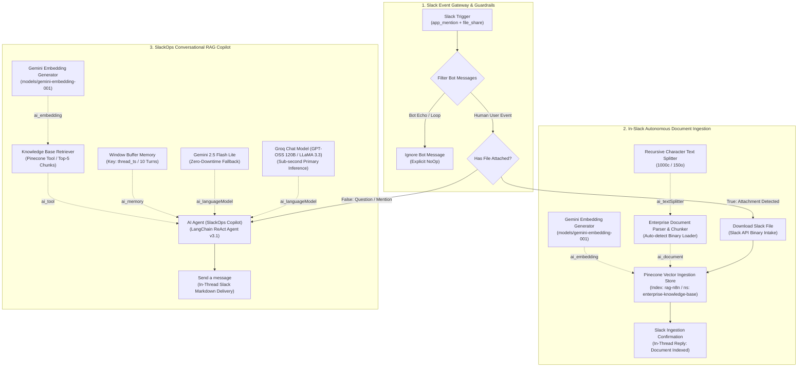

# System Architecture: SlackOps Conversational RAG Copilot

## 1. Architectural Philosophy & Design Principles

The **SlackOps Conversational RAG Copilot** represents a shift from legacy 1-on-1 private web chat assistants to a **multi-user, collaborative workspace copilot**. Operating natively inside Slack, the assistant enables team members to access verified institutional knowledge, resolve technical questions, and index documentation directly within their daily communication hub.



---

## 2. Event Gateway & Loop Prevention Guardrails

In automated Slack bots, message loops are a frequent failure mode: when the bot posts an answer, Slack broadcasts a message event which triggers the bot again in an infinite loop.

The Slack Gateway resolves this through a two-stage filter:
1. **`Slack Trigger` Filter:** Configured explicitly for `["app_mention", "file_share"]` with `downloadFiles: true`.
2. **`Filter Bot Messages` (If Node):**
   - Condition 1: `{{ $json.bot_id }}` is empty.
   - Condition 2: `{{ $json.subtype }}` does not equal `bot_message`.
   - **False Branch (Bot Messages):** Routed to `Ignore Bot Message` (`n8n-nodes-base.noOp`) ensuring zero silent drops and preventing recursive execution.
   - **True Branch (Human Users):** Proceeds to the content router `Has File Attached?`.

---

## 3. Autonomous In-Slack Document Ingestion Pipeline

When an engineer or manager uploads a document (PDF, TXT, DOCX, Markdown) into `#slack-enterprise-rag-assistant`:

1. **Intake & Download:** Slack's API delivers the binary payload directly into `$binary.data`.
2. **Deterministic Chunking:**
   - **Chunk Size:** `1000` characters (~200–250 tokens).
   - **Chunk Overlap:** `150` characters (~30–40 tokens).
   - **Splitter:** `RecursiveCharacterTextSplitter` preserving semantic paragraph boundaries.
3. **Metadata Enrichment:**
   ```json
   {
     "title": "={{ $binary.data?.fileName || $('Slack Trigger').item.json.files?.[0]?.name || 'Enterprise Document' }}",
     "source": "={{ $('Slack Trigger').item.json.files?.[0]?.name || 'Slack Document' }}",
     "category": "slack_enterprise_docs",
     "uploaded_at": "={{ $now.toISO() }}"
   }
   ```
4. **Vector Upsert:** Gemini dense embeddings are calculated and upserted into the Pinecone Serverless index (`rag-n8n`, namespace: `enterprise-knowledge-base`).
5. **In-Thread Acknowledgment:** `Slack Ingestion Confirmation` replies in the exact thread where the file was uploaded, displaying the file name, status, and target vector index.

---

## 4. Conversational RAG & Thread Memory

1. **Thread-Scoped Session State:**
   - Instead of user-level memory (which muddles separate conversations), the `Simple Memory` buffer uses:
     `sessionKey: ={{ $('Slack Trigger').item.json.thread_ts || $('Slack Trigger').item.json.ts }}`
   - Maintains up to **10 conversational turns** per thread.
2. **Dual-Model Fallback Architecture:**
   - **Primary Model:** Groq `llama-3.3-70b-versatile` delivering high-speed context synthesis in under 1 second.
   - **Fallback Model:** Google Gemini `gemini-2.5-flash-lite` ensuring uninterrupted service during API spikes or rate limiting.
3. **In-Thread Delivery:**
   - `Send a message` dynamically sets `thread_ts`, keeping all AI replies neatly threaded and preserving clean channel communication.
