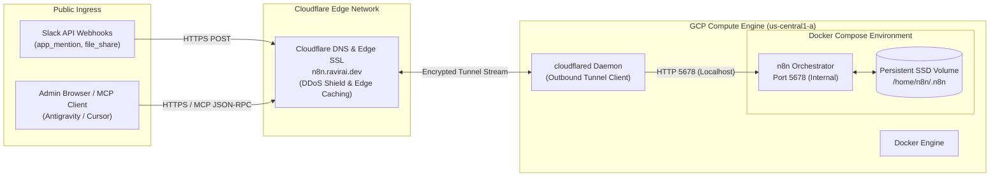

# GCP Production Deployment & Infrastructure Guide

> **Target Endpoint:** `https://n8n.ravirai.dev`  
> **Infrastructure:** Google Cloud Platform (GCP) Compute Engine  
> **Instance Name:** `n8n` | **Zone:** `us-central1-a`  
> **Ingress Security:** Cloudflare Zero Trust Tunnel (`cloudflared`) | End-to-End TLS 1.3

---

## 1. Architectural Overview

Running enterprise AI automation workflows in production requires 24/7 availability, persistent storage, isolated webhook routing, and hardened ingress security. Rather than exposing port `5678` directly to the public internet with open firewall rules, this architecture leverages **GCP Compute Engine** containerized via **Docker Compose**, fronted by an encrypted **Cloudflare Zero Trust Tunnel**.



---

## 2. Infrastructure Provisioning (GCP Compute Engine)

### Instance Sizing & Configuration
- **Machine Family:** General-purpose (`E2`)
- **Machine Type:** `e2-micro` (2 vCPUs, 1 GB RAM) or `e2-medium` (2 vCPUs, 4 GB RAM recommended for multi-turn LangChain & document chunking)
- **Boot Disk:** 25 GB Balanced Persistent Disk (Debian GNU/Linux 12 bookworm)
- **Firewall Rules:** Inbound HTTP/HTTPS rules are **disabled**; all traffic is strictly brokered through the outbound Cloudflare Tunnel.

### Swap Memory Configuration (Crucial for `e2-micro`)
To prevent `Out of Memory (OOM)` kernel kills during heavy PDF chunking and embedding operations:
```bash
sudo fallocate -l 2G /swapfile
sudo chmod 600 /swapfile
sudo mkswap /swapfile
sudo swapon /swapfile
echo '/swapfile none swap sw 0 0' | sudo tee -a /etc/fstab
```

---

## 3. Containerized n8n Stack (`docker-compose.yml`)

The n8n orchestrator runs containerized with persistent host-volume mounting:

```yaml
version: '3.8'

services:
  n8n:
    image: docker.n8n.io/n8nio/n8n:latest
    container_name: n8n-production
    restart: unless-stopped
    ports:
      - "127.0.0.1:5678:5678"
    environment:
      # Core Host & Webhook Settings
      - N8N_HOST=n8n.ravirai.dev
      - N8N_PORT=5678
      - N8N_PROTOCOL=https
      - WEBHOOK_URL=https://n8n.ravirai.dev/
      - GENERIC_TIMEZONE=UTC
      
      # Binary Data & Performance Tuning
      - N8N_DEFAULT_BINARY_DATA_MODE=separate
      - N8N_ENFORCE_SETTINGS_FILE_PERMISSIONS=true
      - EXECUTIONS_DATA_PRUNE=true
      - EXECUTIONS_DATA_MAX_AGE=168  # Retain execution logs for 7 days
      
      # Model Context Protocol (MCP) Server Endpoint
      - N8N_MCP_SERVER_ENABLED=true
      - N8N_DIAGNOSTICS_ENABLED=false
    volumes:
      - /home/n8n/.n8n:/home/node/.n8n
```

### Volume Persistence & File Permissions
Ensure the non-root `node` user (UID `1000`) inside the container has ownership of the database volume:
```bash
sudo mkdir -p /home/n8n/.n8n
sudo chown -R 1000:1000 /home/n8n/.n8n
sudo chmod 700 /home/n8n/.n8n
```
