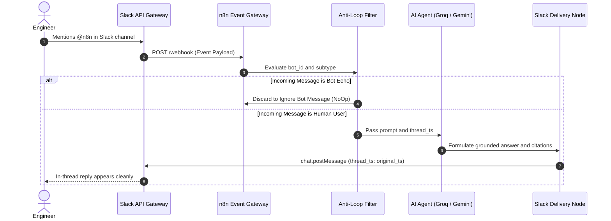

# Slack App Manifest, Event Routing & Security Architecture

This document details the Slack application configuration, OAuth permission scopes, event subscription lifecycle, and security guardrails governing the **SlackOps Conversational RAG Copilot**.

---

## 1. Production Slack App Manifest (JSON)

You can copy and paste this manifest directly into the [Slack App Management Portal](https://api.slack.com/apps) (**Create New App → From an app manifest**):

```json
{
  "display_information": {
    "name": "SlackOps Conversational RAG Copilot",
    "description": "Enterprise autonomous knowledge retrieval and in-channel document indexing assistant.",
    "background_color": "#1A365D"
  },
  "features": {
    "bot_user": {
      "display_name": "SlackOps Copilot",
      "always_online": true
    }
  },
  "oauth_config": {
    "scopes": {
      "bot": [
        "app_mentions:read",
        "channels:history",
        "chat:write",
        "chat:write.customize",
        "files:read",
        "files:write"
      ]
    }
  },
  "settings": {
    "event_subscriptions": {
      "request_url": "https://n8n.ravirai.dev/webhook/ad621192-6932-4cda-a446-c8cdbeb5abed/webhook",
      "bot_events": [
        "app_mention",
        "file_share"
      ]
    },
    "org_deploy_enabled": false,
    "socket_mode_enabled": false,
    "token_rotation_enabled": false
  }
}
```

---

## 2. OAuth Scope Justifications

Every permission granted to the bot adheres to the principle of least privilege:

| Scope | Permission Level | Operational Justification |
| :--- | :---: | :--- |
| **`app_mentions:read`** | Read | Allows the bot to intercept incoming user questions when explicitly tagged (e.g. `@n8n what is our SLA?`). |
| **`channels:history`** | Read | Enables the bot to inspect preceding message context in public channels to resolve references like *"explain step 2"*. |
| **`chat:write`** | Write | Grants permission to post markdown answers, bullet points, and source citations back into the channel. |
| **`chat:write.customize`** | Write | Permits setting custom profile icons and status badges dynamically. |
| **`files:read`** | Read | Enables accessing uploaded PDF, TXT, and DOCX metadata (`url_private_download`) for document vectorization. |
| **`files:write`** | Write | Allows the bot to post file confirmation badges and snippet attachments into the conversation thread. |

---

## 3. Event Verification & Thread State Mechanics



### Thread Isolation Protocol
In Slack channels with dozens of engineers discussing different topics concurrently, using user-level memory keys leads to conversational bleed.

The **SlackOps Copilot** solves this by keying the `Window Buffer Memory` directly to the parent message timestamp:
```javascript
sessionKey: ={{ $('Slack Trigger').item.json.thread_ts || $('Slack Trigger').item.json.ts }}
```
- **New Topic in Channel:** Starts with a new message `ts`, instantiating a fresh memory buffer.
- **Replies in Thread:** Retain the identical `thread_ts`, preserving up to **10 dialogue turns** of relevant conversation history.

---

## 4. Enterprise Security & DLP Guardrails

### 1. Bearer Token Authenticated File Downloads
Slack file URLs (`url_private_download`) are secured behind workspace authorization. Passing raw URLs to unauthenticated crawlers returns HTTP 302 redirects to Slack login pages.
The `Download Slack File` node automatically injects the bot's `Authorization: Bearer xoxb-...` header, safely ingesting the binary stream without exposing tokens to external loggers.

### 2. Infinite Loop Circuit Breaker
Every automated Slack integration risks runaway recursion if a bot listens to channel messages and responds into the same channel.
The upstream `Filter Bot Messages` node enforces an unbypassable circuit breaker:
```javascript
// Drop bot echoes immediately
{{ $json.bot_id ? false : ($json.subtype === 'bot_message' ? false : true) }}
```
Unmatched items terminate in an explicit `Ignore Bot Message` NoOp node, eliminating unnecessary LLM execution and API quota drain.
