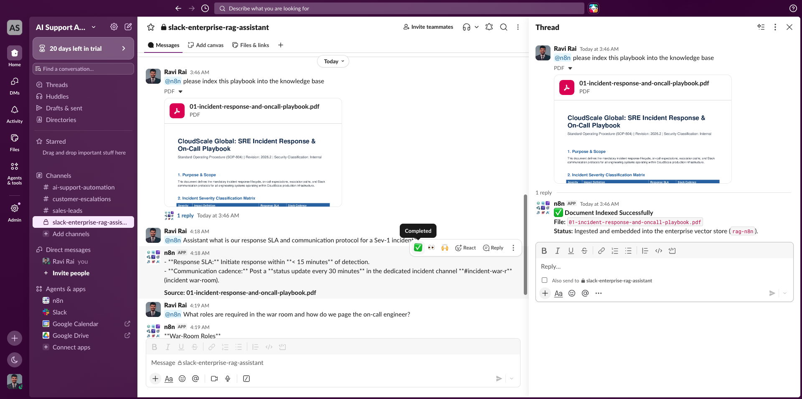
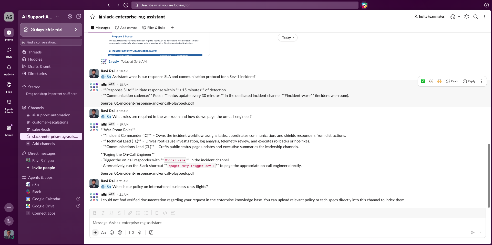

# Enterprise Knowledge Documents, Verification Queries & Real Slack Responses

This directory contains three realistic, corporate-grade technical policies and standard operating procedures (SOPs) engineered for ingestion into the **SlackOps Conversational RAG Copilot** vector store (`rag-n8n` in Pinecone, namespace: `enterprise-knowledge-base`).

All queries and responses documented below reflect the **actual, verified Slack execution** captured from the production workspace (`#slack-enterprise-rag-assistant`) using the bot handle `@n8n`.

---

## 📚 Included Sample Documents

| File Name | Topic & Type | Key Enterprise Facts Contained |
| :--- | :--- | :--- |
| **`01-incident-response-and-oncall-playbook.pdf`** | SRE Standard Operating Procedure (SOP-804) | Sev-1 to Sev-4 severity definitions, response SLAs (<15m for Sev-1, <30m for Sev-2), War Room channels (`#incident-[ticket-id]`), Paging protocols (`@oncall-sre`, `/pager duty trigger sev-1`), 48-hour blameless post-mortem policy. |
| **`02-devops-deployment-and-ci-cd-governance.pdf`** | DevOps & Kubernetes Technical Policy (POL-502) | Production release windows (Tuesdays/Thursdays 10:00–14:00 UTC), Friday deployment freezes, 3-stage canary schedule (5%, 25%, 100%), automated rollback triggers (error rate >0.5%, p99 latency >350ms, restarts >3/pod). |
| **`03-enterprise-it-and-slack-acceptable-use-policy.pdf`** | Corporate Security Standard (SEC-109) | Prohibited secrets & credentials, automated Slack DLP quarantine, message retention (public: 365 days, private: 180 days, DMs: 90 days), stale channel 90-day archival, 180-day guest account lifecycle. |

---

## 📸 Production Verification: Actual Slack Ingestion & Responses

The following interactions are transcribed verbatim from live execution in the Slack workspace.

### 1. In-Slack Autonomous Document Ingestion

**User Action:**
Uploading `01-incident-response-and-oncall-playbook.pdf` into `#slack-enterprise-rag-assistant`:
```text
@n8n please index this playbook into the knowledge base
```



**Verified Bot Response (In-Thread Reply):**
```text
✅ Document Indexed Successfully
File: 01-incident-response-and-oncall-playbook.pdf
Status: Ingested and embedded into the enterprise vector store (rag-n8n).
```

---

### 2. Multi-Turn SRE Query & Thread Follow-up



#### Turn 1: Incident SLA & Communication Protocol
**User Prompt:**
```text
@n8n Assistant what is our response SLA and communication protocol for a Sev-1 incident?
```
**Actual Bot Response:**
```text
- **Response SLA:** Initiate response within **< 15 minutes** of detection.
- **Communication cadence:** Post a **status update every 30 minutes** in the dedicated incident channel **#incident-war-r** (incident war-room).

Source: 01-incident-response-and-oncall-playbook.pdf
```

#### Turn 2: State-Preserving Thread Follow-up
**User Prompt:**
```text
@n8n What roles are required in the war room and how do we page the on-call engineer?
```
**Actual Bot Response:**
```text
**War-Room Roles**
- **Incident Commander (IC)** – Owns the incident workflow, assigns tasks, coordinates communication, and shields responders from distractions.
- **Technical Lead (TL)** – Drives root-cause investigation, log analysis, telemetry review, and executes rollbacks or hot-fixes.
- **Communications Lead (CL)** – Crafts public status-page updates and executive summaries for leadership channels.

**Paging the On-Call Engineer**
- Trigger the on-call responder with **@oncall-sre** in the incident channel.
- Alternatively, run the Slack shortcut **/pager duty trigger sev-1** to page the appropriate on-call engineer directly.

Source: 01-incident-response-and-oncall-playbook.pdf
```

---

### 3. Strict Hallucination Boundary Test (Out-of-Scope Query)

#### Turn 3: Unverified Policy Query
**User Prompt:**
```text
@n8n What is our policy on international business class flights?
```
**Actual Bot Response:**
```text
I could not find verified documentation regarding your request in the enterprise knowledge base. You can upload relevant policy or tech specs directly into this channel to index them.
```

---

## 🧪 Additional Verification Sets for Documents 02 & 03

Use these exact queries in `#slack-enterprise-rag-assistant` after uploading documents `02` and `03`:

### Test Set 2: DevOps CI/CD & Deployment Windows (Doc 02)
1. **Deployment Windows:**
   ```text
   @n8n when are production deployments allowed, and when is the freeze?
   ```
   *Expected Grounding:* Releases permitted Tuesdays and Thursdays 10:00–14:00 UTC. Strict freeze on Fridays after 12:00 UTC, weekends, and quarter-end.  
   *Expected Citation:* `Source: 02-devops-deployment-and-ci-cd-governance.pdf`

2. **Canary Rollback Triggers:**
   ```text
   @n8n what triggers an automatic rollback during a canary release?
   ```
   *Expected Grounding:* Error rate >0.5% over 3 minutes, p99 latency >350ms, or pod restart count >3 within 10 minutes.

### Test Set 3: Enterprise Slack Governance & Security (Doc 03)
3. **Retention Policies:**
   ```text
   @n8n what is the retention policy for Slack messages and direct messages?
   ```
   *Expected Grounding:* Public channels 365 days, private channels 180 days, DMs 90 days.  
   *Expected Citation:* `Source: 03-enterprise-it-and-slack-acceptable-use-policy.pdf`

4. **Secret Handling & DLP:**
   ```text
   @n8n how does our Slack workspace handle accidentally shared API keys or credentials?
   ```
   *Expected Grounding:* DLP scanner instantly quarantines detected secrets and reports them to `#security-alerts`.
