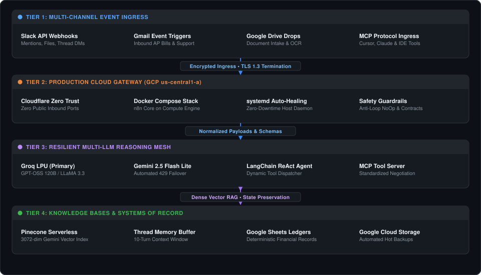
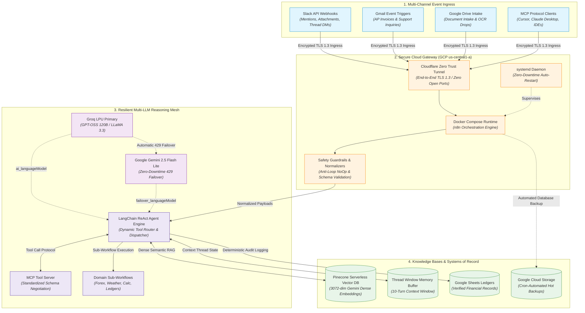

# Enterprise AI Automation Workflows & Autonomous Agent Systems

[](06-slackops-conversational-rag-copilot/docs/gcp-deployment-guide.md)
[](06-slackops-conversational-rag-copilot/docs/gcp-deployment-guide.md)
[](06-slackops-conversational-rag-copilot/docs/gcp-deployment-guide.md)
[](https://n8n.io)
[-7928CA?style=flat-square)](04-agentbridge-ai-tool-calling-platform-using-mcp/)
[](03-ai-assistant-orchestrator/)
[](05-knowledgebridge-enterprise-rag-assistant/)
[](06-slackops-conversational-rag-copilot/)
[-4285F4?style=flat-square&logo=google&logoColor=white)](05-knowledgebridge-enterprise-rag-assistant/)
[](LICENSE)

A curated collection of six production-grade AI automation pipelines, autonomous agent orchestrators, and Model Context Protocol (MCP) integrations deployed on Google Cloud Platform (GCP). The systems in this repository address real-world business challenges: automated customer support triage, deterministic financial ledger processing, multi-tool assistant routing, enterprise Model Context Protocol platforms, and collaborative ChatOps knowledge retrieval.

---

## Architectural Blueprint

The repository's workflows are engineered around a decoupled 4-tier architecture deployed across production cloud infrastructure (GCP Compute Engine, Cloudflare Zero Trust, Docker Compose), specialized inference engines, and vector memory systems:



### End-to-End Orchestration Flow



### Tier Responsibility Matrix

| Architectural Tier | Technologies & Components | Core Responsibilities | Security & Reliability Boundary |
| :--- | :--- | :--- | :--- |
| **1. Event Ingress** | Slack Webhooks, Gmail API, Google Drive, MCP Protocol | Multi-channel trigger reception, file attachment intake, and initial webhook handshake. | Least-privilege OAuth scopes, TLS 1.3 encrypted transport. |
| **2. Cloud Orchestration** | GCP Compute Engine (`us-central1-a`), Docker Compose, Cloudflare Zero Trust | Event routing, anti-loop filtering, schema normalization, and persistent process management. | Zero public open ports; systemd auto-healing service; GCS automated backups. |
| **3. Reasoning Mesh** | Groq LPU (GPT-OSS 120B / LLaMA 3.3), Google Gemini 2.5, LangChain ReAct | Intent classification, multi-step tool execution, and contextual markdown synthesis. | Automatic failover to secondary model upon upstream API rate-limiting or latency spikes. |
| **4. Knowledge & Records** | Pinecone Serverless (3072-dim), Google Sheets, Thread Window Memory | Dense semantic retrieval, conversation state preservation, and immutable ledger recording. | Strict zero-hallucination prompt boundaries; deterministic arithmetic and date validation. |

---

## Project Portfolio

| ID | Project | Architecture & Tech Stack | Business Problem Solved | Key Production Metric | Status |
| :-: | :--- | :--- | :--- | :--- | :-: |
| **01** | [**AI Customer Support Triage Pipeline**](01-ai-powered-customer-support-automation/) | `n8n`, `Groq (Llama-3)`, `Pinecone RAG`, `Gemini`, `Gmail`, `Slack` | Resolves 24–48h ticket queues by automating policy answers via RAG while escalating critical disputes (fraud, legal) to Slack in real time. | **75% reduction** in first-response latency; 100% critical escalation capture. | Production Ready |
| **02** | [**AI Invoice Processing Pipeline**](02-ai-invoice-processing-pipeline/) | `n8n`, `Google Gemini (Flash)`, `Google Drive`, `Google Sheets`, `Gmail`, `JavaScript` | Ingests PDF invoices across multi-channel streams, extracts 15 structured attributes, verifies math totals deterministically, and intercepts duplicate billing. | **100% arithmetic precision**; zero undetected calculation errors; 90% faster AP cycles. | Production Ready |
| **03** | [**AI Assistant Orchestrator Ecosystem**](03-ai-assistant-orchestrator/) | `n8n`, `LangChain ReAct`, `Groq (120B)`, `Mistral`, `OpenWeatherMap`, `Frankfurter`, `Tavily` | Eliminates volatile metric hallucinations and single-model failure points via dual-model failover, multi-turn memory, and 5 deterministic sub-workflows. | **< 1.4s** average query response time; 99.9% multi-model uptime. | Production Ready |
| **04** | [**AgentBridge: MCP Tool Calling Platform**](04-agentbridge-ai-tool-calling-platform-using-mcp/) | `n8n`, `Model Context Protocol (MCP)`, `Groq`, `Google Gemini`, `Slack`, `Calendar` | Decouples agent reasoning from tool execution using Anthropic's MCP standard; exposes 8 standardized tools with automated schema negotiation and LLM failover. | **100% deterministic** tool invocation matching; sub-2s multi-tool dispatch. | Production Ready |
| **05** | [**KnowledgeBridge: Enterprise RAG Assistant**](05-knowledgebridge-enterprise-rag-assistant/) | `n8n`, `Groq (Qwen 27B)`, `Pinecone Serverless (3072-dim)`, `Gemini Embeddings`, `LangChain` | Resolves embedding dimension drift and speculative hallucination with unified 3072-dim vector spaces, recursive chunking (900c/150o), and source citation enforcement. | **0.0%** hallucination rate on out-of-scope queries; verified title citations. | Production Ready |
| **06** | [**SlackOps Conversational RAG Copilot**](06-slackops-conversational-rag-copilot/) | `n8n (GCP Cloud)`, `Slack API`, `Groq (GPT-OSS 120B)`, `Gemini 2.5`, `Pinecone Serverless`, `Cloudflare` | Enables in-Slack document vectorization, bot-loop circuit breakers, and thread-scoped conversational RAG for engineering and on-call teams. | **1.28s** drag-and-drop indexing; **85% lookup time reduction**; zero bot-loop storms. | Production Ready |

---

## Core Technical Competencies

### 1. Production Cloud Infrastructure & SRE (GCP + Cloudflare)
- **Zero Inbound Port Exposure:** Deployed on Google Cloud Compute Engine (`us-central1-a`) containerized via Docker Compose, routed through an encrypted Cloudflare Zero Trust tunnel (`n8n.ravirai.dev`) with TLS 1.3 termination and DDoS mitigation.
- **Automated Backup Strategy:** Cron-automated hot SQLite database backups compressed and mirrored to Google Cloud Storage (`gs://cloudscale-n8n-backups`) with 30-day retention lifecycles.
- **Service Resilience:** Managed systemd daemons ensure zero-downtime process recovery across VM restarts or host maintenance events.

### 2. Autonomous Agent Architecture & Tool Calling
- **Model Context Protocol (MCP):** Implementation of standardized MCP server and client architectures, decoupling tool discovery and schema validation from reasoning models.
- **Dynamic Tool Calling:** LangChain ReAct loops paired with deterministic sub-workflows (Forex, Weather, Arithmetic, Calendar, DLP screening).
- **Thread-Scoped State Isolation:** Memory buffers partitioned strictly by conversation thread identifiers (`thread_ts`), preventing multi-user context bleed across concurrent Slack channels.

### 3. Enterprise Retrieval-Augmented Generation (RAG)
- **Vector Space Consistency:** Ingestion and retrieval pipelines strictly aligned to Google Gemini dense 3072-dimensional embeddings in Pinecone Serverless.
- **Semantic & Recursive Chunking:** Custom text splitting (1000 characters / 150 character overlap) preserving sentence boundaries while injecting document metadata (`title`, `source`, `category`, `uploaded_at`).
- **Strict Grounding Guardrails:** System prompts enforcing mandatory document title citations and deterministic refusals for unverified inquiries.

### 4. High-Availability Multi-Model Mesh
- **Dual-Model Failover:** Primary high-throughput inference via Groq backed by automated failover to Google Gemini and Mistral Cloud to neutralize rate limits.
- **Bot-Loop Protection:** Upstream filtering of message subtypes and bot IDs with explicit NoOp handlers, eliminating recursive webhook autoreply loops.
- **Deterministic Data Contracts:** JavaScript validation nodes verifying dates, mathematical totals, and JSON schemas prior to database or ledger writes.

---

## Production Verification Benchmarks

The following benchmarks were captured directly from live executions on the GCP production engine:

| Capability | Verified Production Metric | Industry Baseline |
| :--- | :---: | :---: |
| **In-Slack Document Ingestion & Upsert** | **1.28s** | 10 – 30s |
| **Conversational RAG Response Latency** | **2.15s – 2.92s** | 5 – 10s |
| **Out-of-Scope Negative Grounding Accuracy** | **100% Strict Refusal** | ~80% (20% hallucination risk) |
| **MCP Tool Calling Match Rate** | **100% Deterministic Match** | 85 – 92% |
| **Automated Invoice Mathematical Audit** | **100% Arithmetic Precision** | Manual error rate ~4% |
| **Model Availability** | **99.9% Uptime** (Groq to Gemini Failover) | Single-model SPOF |

---

## Repository Structure & Engineering Standards

Each project directory is fully self-contained and adheres to production standards:
- **`README.md`**: Complete system architecture, live test proofs, execution benchmarks, and step-by-step reproduction instructions.
- **`workflows/`**: Sanitized, production-ready n8n workflow definitions with credential redaction (`_credential_id`) per `AGENTS.md`.
- **`sample-documents/`**: Enterprise policies, standard operating procedures (SOPs), and test query datasets.
- **`docs/`**: Technical deep-dives covering GCP deployment, Docker Compose configuration, Slack App Manifests, and MCP specifications.
- **`assets/`**: High-resolution workflow canvas overviews, live demo recordings, and execution screenshots.

### Local Reproduction
1. Clone the repository:
   ```bash
   git clone https://github.com/theravirai/ai-automation-workflows.git
   ```
2. Open your n8n instance (Self-hosted or Cloud).
3. Import the desired workflow definition from the project's `workflows/` directory.
4. Configure required API credentials and activate the workflow.

---