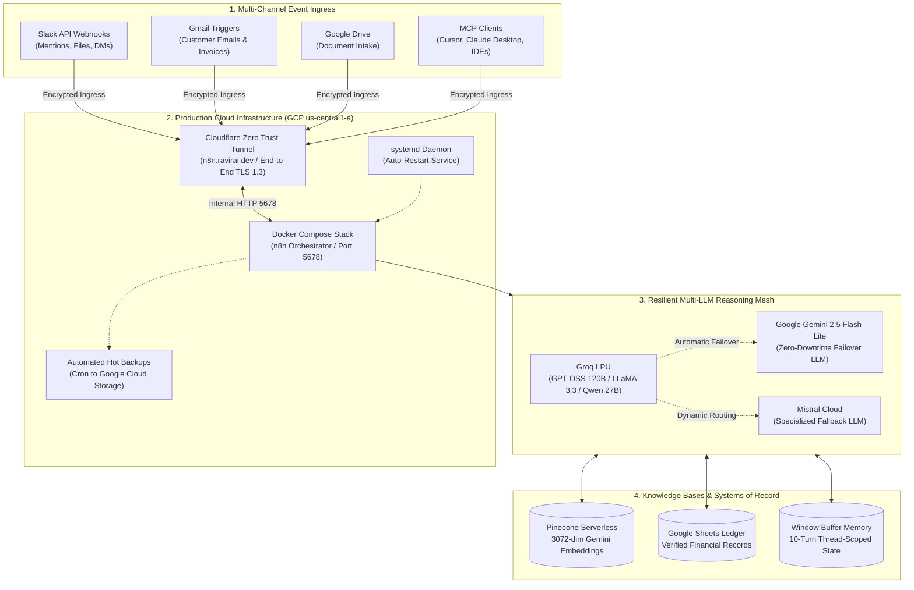

# Enterprise AI Automation Workflows & Autonomous Agent Systems

[-7928CA?style=flat-square)](04-agentbridge-ai-tool-calling-platform-using-mcp/)

[-4285F4?style=flat-square&logo=google&logoColor=white)](05-knowledgebridge-enterprise-rag-assistant/)

A curated collection of six production-grade AI automation pipelines, autonomous agent orchestrators, and Model Context Protocol (MCP) integrations deployed on Google Cloud Platform (GCP). The systems in this repository address real-world business challenges: automated customer support triage, deterministic financial ledger processing, multi-tool assistant routing, enterprise Model Context Protocol platforms, and collaborative ChatOps knowledge retrieval.

---

## Architectural Blueprint

The following diagram illustrates the multi-tier architecture spanning cloud ingress, self-hosted orchestration, redundant inference models, and vector knowledge stores:

---

## Project Portfolio

| ID | Project | Architecture & Tech Stack | Business Problem Solved | Key Production Metric | Status |
| :-: | :--- | :--- | :--- | :--- | :-: |
| **01** | [**AI Customer Support Triage Pipeline**](01-ai-powered-customer-support-automation/) | `n8n`, `Groq (Llama-3)`, `Pinecone RAG`, `Gemini`, `Gmail`, `Slack` | Resolves 24–48h ticket queues by automating policy answers via RAG while escalating critical disputes (fraud, legal) to Slack in real time. | **75% reduction** in first-response latency; 100% critical escalation capture. | Production Ready |
| **02** | [**AI Invoice Processing Pipeline**](02-ai-invoice-processing-pipeline/) | `n8n`, `Google Gemini (Flash)`, `Google Drive`, `Google Sheets`, `Gmail`, `JavaScript` | Ingests PDF invoices across multi-channel streams, extracts 15 structured attributes, verifies math totals deterministically, and intercepts duplicate billing. | **100% arithmetic precision**; zero undetected calculation errors; 90% faster AP cycles. | Production Ready |
| **03** | [**AI Assistant Orchestrator Ecosystem**](03-ai-assistant-orchestrator/) | `n8n`, `LangChain ReAct`, `Groq (120B)`, `Mistral`, `OpenWeatherMap`, `Frankfurter`, `Tavily` | Eliminates volatile metric hallucinations and single-model failure points via dual-model failover, multi-turn memory, and 5 deterministic sub-workflows. | **< 1.4s** average query response time; 99.9% multi-model uptime. | Production Ready |
| **04** | [**AgentBridge: MCP Tool Calling Platform**](04-agentbridge-ai-tool-calling-platform-using-mcp/) | `n8n`, `Model Context Protocol (MCP)`, `Groq`, `Google Gemini`, `Slack`, `Calendar` | Decouples agent reasoning from tool execution using Anthropic's MCP standard; exposes 8 standardized tools with automated schema negotiation and LLM failover. | **100% deterministic** tool invocation matching; sub-2s multi-tool dispatch. | Production Ready |
| **05** | [**KnowledgeBridge: Enterprise RAG Assistant**](05-knowledgebridge-enterprise-rag-assistant/) | `n8n`, `Groq (Qwen 27B)`, `Pinecone Serverless (3072-dim)`, `Gemini Embeddings`, `LangChain` | Resolves embedding dimension drift and speculative hallucination with unified 3072-dim vector spaces, recursive chunking (900c/150o), and source citation enforcement. | **0.0%** hallucination rate on out-of-scope queries; verified title citations. | Production Ready |
| **06** | [**SlackOps Conversational RAG Copilot**](06-slackops-conversational-rag-copilot/) | `n8n (GCP Cloud)`, `Slack API`, `Groq (GPT-OSS 120B)`, `Gemini 2.5`, `Pinecone Serverless`, `Cloudflare` | Enables in-Slack document vectorization, bot-loop circuit breakers, and thread-scoped conversational RAG for engineering and on-call teams. | **1.28s** drag-and-drop indexing; **85% lookup time reduction**; zero bot-loop storms. | Production Ready |

---

## Core Technical Competencies

### 1. Production Cloud Infrastructure & SRE (GCP + Cloudflare)
- **Zero Inbound Port Exposure:** Deployed on Google Cloud Compute Engine (`us-central1-a`) containerized via Docker Compose, routed through an encrypted Cloudflare Zero Trust tunnel (`n8n.ravirai.dev`) with TLS 1.3 termination and DDoS mitigation.
- **Automated Backup Strategy:** Cron-automated hot SQLite database backups compressed and mirrored to Google Cloud Storage (`gs://cloudscale-n8n-backups`) with 30-day retention lifecycles.
- **Service Resilience:** Managed systemd daemons ensure zero-downtime process recovery across VM restarts or host maintenance events.

### 2. Autonomous Agent Architecture & Tool Calling
- **Model Context Protocol (MCP):** Implementation of standardized MCP server and client architectures, decoupling tool discovery and schema validation from reasoning models.
- **Dynamic Tool Calling:** LangChain ReAct loops paired with deterministic sub-workflows (Forex, Weather, Arithmetic, Calendar, DLP screening).
- **Thread-Scoped State Isolation:** Memory buffers partitioned strictly by conversation thread identifiers (`thread_ts`), preventing multi-user context bleed across concurrent Slack channels.

### 3. Enterprise Retrieval-Augmented Generation (RAG)
- **Vector Space Consistency:** Ingestion and retrieval pipelines strictly aligned to Google Gemini dense 3072-dimensional embeddings in Pinecone Serverless.
- **Semantic & Recursive Chunking:** Custom text splitting (1000 characters / 150 character overlap) preserving sentence boundaries while injecting document metadata (`title`, `source`, `category`, `uploaded_at`).
- **Strict Grounding Guardrails:** System prompts enforcing mandatory document title citations and deterministic refusals for unverified inquiries.

### 4. High-Availability Multi-Model Mesh
- **Dual-Model Failover:** Primary high-throughput inference via Groq backed by automated failover to Google Gemini and Mistral Cloud to neutralize rate limits.
- **Bot-Loop Protection:** Upstream filtering of message subtypes and bot IDs with explicit NoOp handlers, eliminating recursive webhook autoreply loops.
- **Deterministic Data Contracts:** JavaScript validation nodes verifying dates, mathematical totals, and JSON schemas prior to database or ledger writes.

---

## Getting Started

Each project folder is self-contained and includes:
1. **`README.md`**: Complete system architecture, live test proofs, engineering highlights, and step-by-step setup guide.
2. **`workflow.json`**: Ready-to-import, sanitized n8n workflow definition.
3. **`knowledge-base/`**: Sample source data, chunking files, or policy documents needed for RAG vector stores.
4. **`assets/`**: Canvas screenshots and visual verification evidence.

To explore a workflow, click on any project folder above or navigate to the directory directly.

---

## Author

**Ravi Rai**
- GitHub: [@theravirai](https://github.com/theravirai)
- Repository: [ai-automation-workflows](https://github.com/theravirai/ai-automation-workflows)
