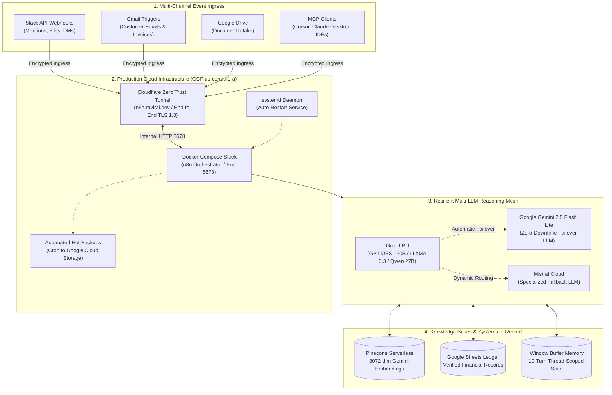

# Enterprise AI Automation Workflows & Autonomous Agent Systems

[-7928CA?style=flat-square)](04-agentbridge-ai-tool-calling-platform-using-mcp/)

[-4285F4?style=flat-square&logo=google&logoColor=white)](05-knowledgebridge-enterprise-rag-assistant/)

A curated collection of six production-grade AI automation pipelines, autonomous agent orchestrators, and Model Context Protocol (MCP) integrations deployed on Google Cloud Platform (GCP). The systems in this repository address real-world business challenges: automated customer support triage, deterministic financial ledger processing, multi-tool assistant routing, enterprise Model Context Protocol platforms, and collaborative ChatOps knowledge retrieval.

---

## Architectural Blueprint

The following diagram illustrates the multi-tier architecture spanning cloud ingress, self-hosted orchestration, redundant inference models, and vector knowledge stores:

---

## Project Catalog

| # | Project | Tech Stack | Description | Status |
| :-: | :--- | :--- | :--- | :-: |
| **01** | [**AI-Powered Customer Support Automation**](01-ai-powered-customer-support-automation/) | `n8n`, `Groq (Llama-3)`, `Pinecone RAG`, `Gemini`, `Gmail`, `Slack` | Autonomous inbound email triage, zero-shot intent routing, RAG-grounded customer support resolution, and real-time Slack escalation alerting. | ✅ Production Ready |
| **02** | [**AI Invoice Processing Pipeline**](02-ai-invoice-processing-pipeline/) | `n8n`, `Google Gemini (Flash)`, `Google Drive`, `Google Sheets`, `Gmail`, `JavaScript` | Automated enterprise invoice intake, multimodal PDF text extraction, structured Gemini Information Extractor, deterministic mathematical & date validation, Google Sheets ledger recording, and executive HTML email dispatch. | ✅ Production Ready |
| **03** | [**AI Assistant Orchestrator & Tool Ecosystem**](03-ai-assistant-orchestrator/) | `n8n`, `LangChain`, `Groq (120B)`, `Mistral`, `OpenWeatherMap`, `Frankfurter API`, `Tavily` | Conversational ReAct AI assistant with dual-model failover, multi-turn memory, real-time currency conversion, deterministic sub-workflow weather intelligence, and arithmetic calculations. | ✅ Production Ready |
| **04** | [**AgentBridge: AI Tool Calling Platform using MCP**](04-agentbridge-ai-tool-calling-platform-using-mcp/) | `n8n`, `Model Context Protocol (MCP)`, `Groq`, `Google Gemini`, `Slack`, `Calendar` | Enterprise AI platform decoupling high-level agent reasoning from execution via Model Context Protocol (MCP), featuring dual-model failover, 10-turn memory window, and 8 standardized tools. | ✅ Production Ready |
| **05** | [**KnowledgeBridge: Enterprise RAG Assistant**](05-knowledgebridge-enterprise-rag-assistant/) | `n8n`, `Groq (Qwen 27B)`, `Pinecone RAG (3072-dim)`, `Gemini Embeddings`, `LangChain` | Autonomous enterprise knowledge retrieval assistant featuring document ingestion with 3072-dim embeddings, 10-turn window memory, and strictly grounded conversational retrieval. | ✅ Production Ready |
| **06** | [**SlackOps Conversational RAG Copilot**](06-slackops-conversational-rag-copilot/) | `n8n (GCP Cloud)`, `Slack API`, `Groq (GPT-OSS 120B)`, `Gemini (Flash Fallback)`, `Pinecone RAG` | Enterprise Slack knowledge copilot featuring autonomous in-Slack document vectorization, bot-loop guardrails, 10-turn thread-scoped memory, and in-thread citations. | ✅ Production Ready |

---

## 🛠️ Architecture & Engineering Standards

Every workflow in this repository is built following strict enterprise software and agentic design principles:

- **Strict RAG Grounding:** LLM agents are bounded to verified vector knowledge bases with zero-hallucination prompts and identical ingestion/retrieval embedding spaces.
- **Resilient Event Routing:** Intent classifiers maintain mutually exclusive domain boundaries with explicit catch-alls and no-ops to eliminate silent message drops.
- **Asynchronous & Non-Blocking:** Multi-channel alerting (Slack, email, CRM) is decoupled from core transactional paths to prevent system stalls.
- **Deterministic Data Contracts:** Normalized data nodes (e.g. `Edit Fields`) sit between triggers and reasoning models to facilitate modular testing with pinned mock payloads.
- **Zero Secrets in Code:** Credentials and tokens are managed via environment variables and instance secrets - never committed to version control.

---

## Getting Started

Each project folder is self-contained and includes:
1. **`README.md`**: Complete system architecture, live test proofs, engineering highlights, and step-by-step setup guide.
2. **`workflow.json`**: Ready-to-import, sanitized n8n workflow definition.
3. **`knowledge-base/`**: Sample source data, chunking files, or policy documents needed for RAG vector stores.
4. **`assets/`**: Canvas screenshots and visual verification evidence.

To explore a workflow, click on any project folder above or navigate to the directory directly.

---

## Author

**Ravi Rai**
- GitHub: [@theravirai](https://github.com/theravirai)
- Repository: [ai-automation-workflows](https://github.com/theravirai/ai-automation-workflows)
